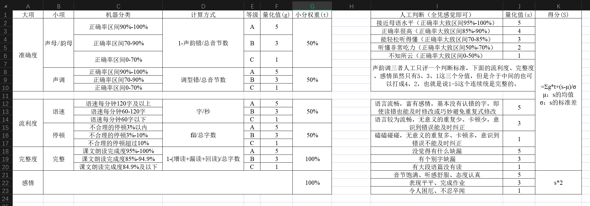
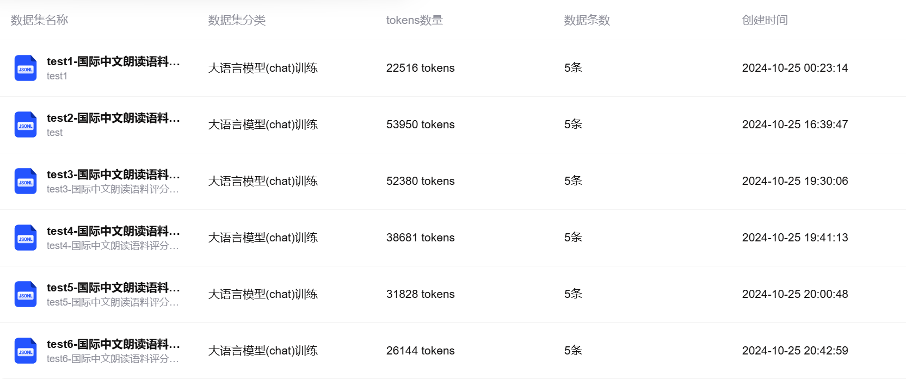
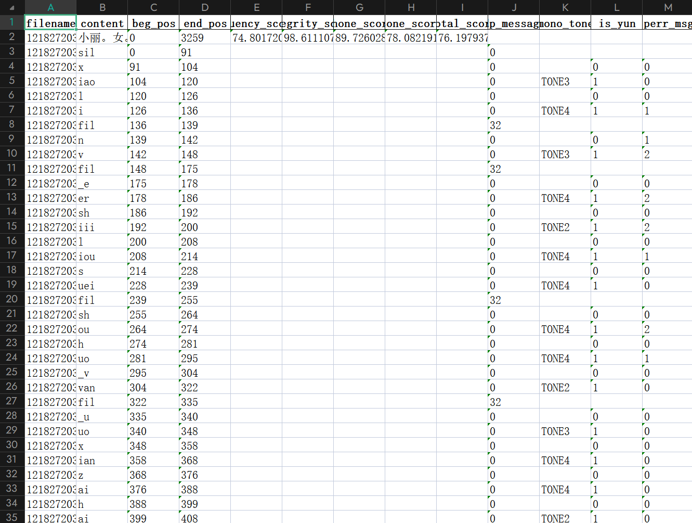
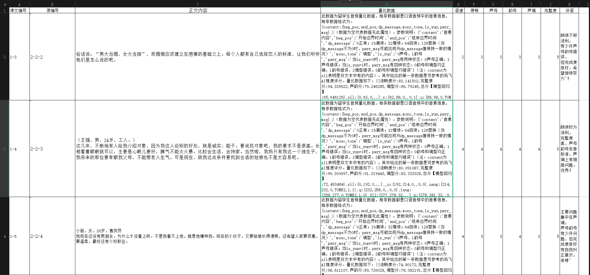

# 国际中文朗读语料评分模型建构与优化实践

---

## 一、项目简介

### 2.1 需求分析

### 2.2 扩展可能性

### 2.3 社会价值

---

## 二、Web

> <u>***网址***</u>：

### 2.1 需求分析

### 2.2 功能介绍

### 2.3 UI设计

---

## 三、模型训练

### 3.1 模型的选择

与AI的一些交流：

``````markdown
# 关于模型选择的一些疑问

---

---

## 来自你的消息:

对于一个模型进行微调，请问LoRA微调和全参数微调的区别

## 来自WeTab AI的消息:

LoRA（Low-Rank Adaptation）微调和全参数微调是两种不同的模型微调方法，它们在参数更新方式和计算资源需求上有所区别。以下是它们的主要区别：

### 1. **全参数微调（Full Parameter Fine-tuning）**

- **概念**：全参数微调是指在微调过程中，更新预训练模型中的所有参数。这意味着模型的每一层、每一个权重都有可能在训练过程中被调整。
- **优点**：
  - 可以最大程度地调整模型以适应特定任务，通常能够获得较好的性能。
  - 适合资源充足且对模型精度要求极高的任务。
- **缺点**：
  - **计算成本高**：需要更新大量的参数，因此需要更多的计算资源和时间。
  - **存储成本高**：每个微调后的模型都需要保存整个模型参数，导致存储需求增加。
  - **容易过拟合**：在数据量有限的情况下，全参数微调容易导致过拟合。

### 2. **LoRA微调（Low-Rank Adaptation）**

- **概念**：LoRA微调是一种参数高效的微调方法，它通过在模型的某些层中引入低秩矩阵（low-rank matrices）来进行参数更新，而不改变原始模型的参数。具体来说，LoRA在模型的某些关键部分（如自注意力机制中的权重矩阵）添加可训练的秩分解矩阵，而保持原始模型的参数不变。
- **优点**：
  - **计算效率高**：只需要训练少量的额外参数（低秩矩阵），大大减少了计算和内存需求。
  - **存储效率高**：由于原始模型参数保持不变，只需要存储和更新少量的额外参数，因此存储需求也大大降低。
  - **减少过拟合风险**：因为只更新少量参数，LoRA在数据有限的情况下通常比全参数微调更不容易过拟合。
- **缺点**：
  - 在某些情况下，LoRA的精度可能略低于全参数微调，因为它对原始模型的改动较少。
  - 需要对低秩矩阵的秩进行合理选择，以获得最佳性能。

### 总结

- **全参数微调**：更新整个模型的所有参数，适合资源充足且对精度要求极高的任务，但计算和存储成本高。
- **LoRA微调**：通过引入低秩矩阵来更新少量参数，计算和存储成本低，适合资源有限的任务，且在数据有限的情况下表现较好。

在实际应用中，选择哪种微调方法通常取决于可用的计算资源、数据量以及对模型性能的要求。

---

## 来自你的消息:

全参数微调后只能部署才能使用模型嘛

## 来自WeTab AI的消息:

不一定，全参数微调后的模型不仅可以部署使用，还可以在本地或其他环境中直接使用。以下是一些常见的使用场景：

### 1. **本地测试和开发**

- **直接加载模型**：在进行全参数微调后，你可以将模型保存为一个文件（如 `.pt`, `.pth`, `.bin` 等格式），然后在本地环境中加载并使用该模型进行测试、开发或进一步研究。
- **Jupyter Notebook 或脚本**：你可以在 Jupyter Notebook 或其他脚本中加载并使用微调后的模型，进行推理、调试或实验。

### 2. **部署到服务器或云平台**

- **API 服务**：你可以将微调后的模型部署为一个 REST API 服务，用户可以通过 HTTP 请求来调用模型进行推理。
- **容器化部署**：使用 Docker 或其他容器化技术将微调后的模型打包成一个容器镜像，然后部署到云平台（如 AWS, Google Cloud, Azure 等）。
- **微服务架构**：在微服务架构中，可以将模型作为一个单独的服务部署，通过消息队列或其他通信机制与其他服务进行交互。

### 3. **嵌入式设备或移动端**

- **模型压缩和量化**：对于资源受限的设备（如嵌入式系统或移动设备），你可以对微调后的模型进行压缩和量化，以减少模型的大小和计算复杂度，然后在这些设备上直接运行模型。
- **边缘计算**：在边缘计算环境中，微调后的模型可以在本地设备上运行，减少对云端资源的依赖。

### 4. **集成到应用中**

- **桌面应用**：将微调后的模型集成到桌面应用程序中，为用户提供离线推理能力。
- **移动应用**：将模型集成到移动应用中，为用户提供实时的推理服务。

### 总结

全参数微调后的模型不仅仅可以部署使用，还可以在多种环境中灵活使用。无论是在本地开发、测试，还是在云端、嵌入式设备或移动端部署，微调后的模型都可以根据需求进行加载和使用。具体选择哪种方式取决于你的应用场景和资源限制。

---

## 来自你的消息:

训练后直接调用和私有部署有什么区别

## 来自WeTab AI的消息:

训练后直接调用和私有部署是两种在不同环境中使用已训练模型的方式，它们各自有不同的特点和适用场景。以下是这两者的主要区别：

### 1. **训练后直接调用**

- **定义**：指在训练后，直接在本地环境或开发环境（如 Jupyter Notebook、Python 脚本等）中加载模型，实现推理调用。

- **特点**：
  - **简便性**：通常比较简单，只需加载模型文件，然后调用推理函数即可。
  - **适用于小规模测试**：适合开发阶段、原型制作或小规模实验，方便快速验证模型效果。
  - **资源需求低**：不需要额外的部署、维护和服务器管理，适合个人用户或小型团队使用。
  - **性能限制**：可能受到单机硬件资源的限制，如果需要处理大量请求，可能会面临性能瓶颈。

- **例子**：
  - 在本地用 Python 加载训练好的模型，然后在小批量数据上进行预测，进行模型评估或实验。

### 2. **私有部署**

- **定义**：指将训练好的模型部署到专用服务器或云平台上，以便为应用程序或用户提供服务。

- **特点**：
  - **可扩展性**：可以在服务器上配置资源，以支持大量请求并进行负载均衡，提高模型的可用性和响应时间。
  - **安全性**：可以在私有环境中控制数据和模型，对模型和用户数据进行保护，确保数据隐私。
  - **服务化**：可以将模型封装为 API，方便其他应用程序调用，适合集成到商业应用或者生产环境中。
  - **监控和维护**：能够实时监控模型的性能，维护和更新变得更加系统化。

- **例子**：
  - 在云平台上将模型封装为 REST API，用户通过 HTTP 请求来调用该 API 进行实时推理；或者将模型通过 Docker 容器化，以便在多台服务器上运行。

### 总结

- **直接调用**主要用于快速测试、开发和小规模使用，适合开发者在本地环境中进行模型验证和实验。
- **私有部署**则适合于生产环境，支持更高的可扩展性、安全性和维护性，通常用于需要处理更大规模用户请求的商业应用。

根据具体使用场景的需求和资源的可用性，选择合适的方式进行模型的使用和调用。

---

## 来自你的消息:

这两种方式的并发量如何

## 来自WeTab AI的消息:

并发量是指系统在同一时间内能够处理的最大请求数量。训练后直接调用和私有部署在并发处理能力上有显著的区别。以下是对这两种方式并发量能力的详细分析：

### 1. **训练后直接调用**

- **定义**：在本地环境（如个人电脑、开发机）中直接加载和调用训练好的模型。

- **并发量特点**：
  - **受限于单机硬件**：并发量主要取决于本地机器的硬件性能，如CPU、GPU、内存等资源。通常情况下，单机的并发能力有限。
  - **处理能力较低**：如果模型需要较重的计算资源（如深度学习模型），单机环境的并发能力会更低。通常只能处理几十到几百个并发请求。
  - **依赖开发环境**：主要依赖开发环境如Python解释器、TensorFlow、PyTorch等框架的性能和资源管理能力。

- **具体应用场景**：
  - **小规模测试和开发**：适合开发者进行模型验证、调试和小规模实验。
  - **有限用户访问**：如果用户数量较少，且对响应时间要求不高，可以考虑在本地环境直接调用。

### 2. **私有部署**

- **定义**：将训练好的模型部署到专用服务器或云平台，利用服务器集群、负载均衡等技术提供服务。

- **并发量特点**：
  - **可扩展性高**：可以通过横向扩展（增加服务器数量）和纵向扩展（增加单台服务器的硬件资源）来提升系统的并发处理能力。
  - **处理能力高**：在合理配置的服务器集群上，可以处理成千上万的并发请求，具体数量取决于服务器集群的规模和配置。
  - **服务化**：通过将模型封装为API，可以方便地集成到各种应用中，支持大规模用户访问和调用。

- **具体应用场景**：
  - **大规模用户访问**：适合需要处理大量用户请求的场景，如在线服务、商业应用等。
  - **实时响应需求**：适用于对响应时间要求高的应用，如实时推荐系统、实时翻译等。

### 总结

- **训练后直接调用**：并发量受限于本地硬件资源，通常只能处理几十到几百个并发请求，适合小规模测试和开发。
- **私有部署**：并发量可以通过扩展服务器集群显著提升，可以处理成千上万的并发请求，适合大规模用户访问和实时响应需求。

选择哪种方式取决于应用的具体需求，如用户规模、响应时间要求和可用的硬件资源。对于需要高并发处理能力的应用，私有部署是更合适的选择。

---

## 来自你的消息:

你了解GLM-4-Flash、GLM-4-AirX、GLM-4-Air、GLM-4-9B、ChatGLM3-6B模型嘛，它们用来LoRA微调的效果分别如何

## 来自WeTab AI的消息:

GLM系列模型是基于深度学习的生成语言模型，通常用于自然语言处理任务，如文本生成、问答系统等。以下是对提到的几个GLM模型的简要介绍以及它们在LoRA微调中的效果评估：

### 1. **GLM-4-Flash**

- **概述**：GLM-4-Flash是一个高效的大型语言模型，专注于快速推理和处理速度。
- **LoRA微调效果**：由于其高效的架构设计，GLM-4-Flash在LoRA微调后能够保持较高的处理速度，同时保持较好的语言生成质量。适合需要快速响应和高效率的应用场景。

### 2. **GLM-4-AirX**

- **概述**：GLM-4-AirX是一个轻量级的语言模型，设计用于移动设备和嵌入式系统。
- **LoRA微调效果**：由于其轻量级设计，GLM-4-AirX在LoRA微调后能够在资源受限的环境中保持较好的性能。适用于移动应用和边缘计算场景。

### 3. **GLM-4-Air**

- **概述**：GLM-4-Air是另一个轻量级语言模型，设计目标与GLM-4-AirX相似，但可能在某些方面有所不同。
- **LoRA微调效果**：与GLM-4-AirX类似，GLM-4-Air在LoRA微调后也能在资源受限的环境中表现良好。适用于需要轻量级解决方案的场景。

### 4. **GLM-4-9B**

- **概述**：GLM-4-9B是一个中等规模的语言模型，具有较高的语言理解和生成能力。
- **LoRA微调效果**：GLM-4-9B在LoRA微调后能够显著提升其在特定任务上的表现，尤其是在数据量有限的情况下。适用于需要较高精度和中等计算资源的应用。

### 5. **ChatGLM3-6B**

- **概述**：ChatGLM3-6B是一个专门设计用于对话系统的语言模型，具有较好的对话生成能力。
- **LoRA微调效果**：ChatGLM3-6B在LoRA微调后可以在对话任务中表现出色，特别是在特定领域（如客服、教育等）中微调后，能够生成更符合上下文和用户需求的回复。适用于对话系统开发。

### 总结

- **GLM-4-Flash**：高效率，适合快速响应。
- **GLM-4-AirX** 和 **GLM-4-Air**：轻量级，适合嵌入式和移动设备。
- **GLM-4-9B**：中等规模，适合中等计算资源需求。
- **ChatGLM3-6B**：专门用于对话系统，在对话任务中表现优秀。

在LoRA微调后，这些模型都能够根据特定任务进行优化，提升模型性能。具体选择哪个模型进行LoRA微调，取决于应用场景的需求和可用的计算资源。

---

## 来自你的消息:

{"messages": [{"role": "system", "content": "你是一个给留学生中文口语打分的国汉老师，你的打分标准是：{ \"评分标准\": { \"准确度\": { \"声母/韵母\": { \"机器分类标准\": { \"正确率90%-100%\": { \"量化值\": 5, \"描述\": \"正确率很高\", \"计算方式\": \"1-声韵错/总音节数\" }, \"正确率70%-90%\": { \"量化值\": 3, \"描述\": \"能轻松听得懂\", \"计算方式\": \"1-声韵错/总音节数\" }, \"正确率0%-70%\": { \"量化值\": 1, \"描述\": \"听懂非常吃力\", \"计算方式\": \"1-声韵错/总音节数\" } }, \"小分权重\": \"50%\" }, \"声调\": { \"机器分类标准\": { \"正确率区间90%-100%\": { \"量化值\": 5, \"描述\": \"正确率很高\", \"计算方式\": \"调型错/总音节数\" }, \"正确率区间70-90%\": { \"量化值\": 3, \"描述\": \"能轻松听得懂\", \"计算方式\": \"调型错/总音节数\" }, \"正确率区间0-70%\": { \"量化值\": 1, \"描述\": \"听懂非常吃力\", \"计算方式\": \"调型错/总音节数\" } }, \"小分权重\": \"50%\" }, \"总分占比\": \"55%\" }, \"流利度\": { \"语速\": { \"机器分类标准\": { \"语速每分钟120字及以上\": { \"量化值\": 5, \"描述\": \"语言流畅\", \"计算方式\": \"字/秒\" }, \"语速每分钟60-120字\": { \"量化值\": 3, \"描述\": \"语言较为流畅\", \"计算方式\": \"字/秒\" }, \"语速每分钟60字以下\": { \"量化值\": 1, \"描述\": \"无意义的重复多、卡顿多\", \"计算方式\": \"字/秒\" } }, \"小分权重\": \"50%\" }, \"停顿\": { \"机器分类标准\": { \"不合理的停顿3%以内\": { \"量化值\": 5, \"描述\": \"语言流畅\", \"计算方式\": \"fil/总字数\" }, \"不合理的停顿3%-10%\": { \"量化值\": 3, \"描述\": \"语言较为流畅\", \"计算方式\": \"fil/总字数\" }, \"不合理的停顿超过10%\": { \"量化值\": 1, \"描述\": \"无意义的重复多、卡顿多\", \"计算方式\": \"fil/总字数\" } }, \"小分权重\": \"50%\" }, \"总分占比\": \"25%\" }, \"完整度\": { \"完整\": { \"机器分类标准\": { \"课文朗读完成度95%-100%\": { \"量化值\": 5, \"描述\": \"没觉得有什么缺漏\", \"计算方式\": \"1-(增读+漏读+回读)/总字数\" }, \"课文朗读完成度85%-94.9%\": { \"量化值\": 3, \"描述\": \"有个别字缺漏\", \"计算方式\": \"1-(增读+漏读+回读)/总字数\" }, \"课文朗读完成度84.9%及以下\": { \"量化值\": 1, \"描述\": \"有大段语篇没有读\", \"计算方式\": \"1-(增读+漏读+回读)/总字数\" } }, \"小分权重\": \"100%\" }, \"总分占比\": \"10%\" }, \"感情\": { \"感情\": { \"机器分类标准\": { \"音节饱满、听感舒服、态度认真\": { \"量化值\": 5 }, \"表现平平、完成作业\": { \"量化值\": 3 }, \"令人困厄、不忍卒闻\": { \"量化值\": 1 } }, \"小分权重\": \"100%\" }, \"总分占比\": \"10%\" } } }"}, {"role": "user", "content": "我是一位学习中文口语的留学生，我的朗读内容是{俗话说：“男大当婚，女大当嫁”，而婚姻应该建立在感情的基础之上。每个人都有自己选择恋人的标准，让我们听听他们是怎么说的吧。}。我的音频的量化数据是{此数据为学生音频量化数据，格式为：content:{beg_pos,end_pos,symbol,time_len,rec_node_type,dp_message,is_yun,perr_msg,perr_level_msg};（null为空值）sil:{0,62,null,62,sil,0.0,null,null,null};俗:{62,98,su2,36,paper,null,null,null,null};s:{62,88,null,26,paper,0.0,0.0,1.0,3.0};u:{88,98,null,10,paper,0.0,1.0,0.0,1.0};话:{98,114,hua4,16,paper,null,null,null,null};h:{98,106,null,8,paper,0.0,0.0,0.0,1.0};ua:{106,114,null,8,paper,0.0,1.0,1.0,3.0};说:{114,172,shuo1,58,paper,null,null,null,null}.......。你是一位给留学生中文口语打分的国汉老师，请你给我的语速、停顿、声母、韵母、声调和完整度进行分别打分并给出评语。输出格式例子：语速：2；停顿：3；声母：3；韵母：3；声调：3；完整度：5；评语：朗读不够流利，有少许声母韵母错误，但完成度很好，希望继续努力~！"}, {"role": "assistant", "content": "语速：2；停顿：3；声母：3；韵母：3；声调：3；完整度：5；评语：朗读不够流利，\n有少许声母韵母错误，\n但完成度很好，希望继续努力~！"}]}
上面的训练数据和要求，适合GLM-4-Flash、GLM-4-AirX、GLM-4-Air、GLM-4-9B、ChatGLM3-6B哪个模型进行LoRA训练，预计数据量在200条左右，要求分析这次的训练特征以及每个模型的优缺点

## 来自WeTab AI的消息:

根据您提供的训练数据和任务要求，我们需要选择一个适合的模型进行 LoRA（Low-Rank Adaptation）微调，以处理约 200 条中文口语打分相关的数据。我们将从以下几个方面进行分析，并评估 **GLM-4-Flash**、**GLM-4-AirX**、**GLM-4-Air**、**GLM-4-9B**、**ChatGLM3-6B** 这五个模型的适用性。

### 1. 任务特征分析

- **任务类型**：
  - 该任务涉及对中文口语进行打分，具体包括对语速、停顿、声母、韵母、声调和完整度的判断。
  - 这是一个自然语言处理的任务，但包含了语音识别和语言理解的元素，特别是对于声母、韵母、声调的识别。
  - 数据量为 200 条左右，属于较小的数据集，适合使用 LoRA 微调策略来进行小样本学习。

- **数据特点**：
  - 每条数据包含音频的量化数据，以及对不同评分项（语速、停顿、声母、韵母、声调、完整度）的具体要求。
  - 数据结构相对复杂，需要处理符号和时间长度信息，并结合这些信息进行推理和打分。

### 2. 模型优缺点分析

#### **GLM-4-Flash**

- **优点**：
  - 该模型专注于推理速度和低延迟，适合实时或快速响应的应用场景。
  - 对于需要快速处理多个短文本（如逐句打分）的任务，Flash 的推理速度会是一个优势。

- **缺点**：
  - 可能在处理复杂推理任务时表现不如更大参数量的模型，特别是在声母、韵母和声调的精细区分上，可能略有不足。

- **适用性**：
  - 适合对实时性要求较高但推理复杂度要求相对较低的任务。如果打分任务需要实时反馈，GLM-4-Flash 可以是一个不错的选择。

#### **GLM-4-AirX 和 GLM-4-Air**

- **优点**：
  - 这两个模型都是轻量级模型，适合在资源受限的环境下高效运行。
  - 它们的推理速度和内存占用相对较低，同时能保持一定的性能。

- **缺点**：
  - 由于模型较小，可能在处理复杂的语言理解和语音识别任务时表现稍弱，尤其是对于声母、韵母和声调的精细分类。

- **适用性**：
  - 适合资源有限、但对推理速度和计算资源要求较高的任务。对于本次任务，如果计算资源较为紧张，可以考虑 GLM-4-AirX 或 GLM-4-Air。但从整体精度和复杂度来看，它们可能不是最佳选择。

#### **GLM-4-9B**

- **优点**：
  - 这是一个参数量为 9 亿的较大模型，具有较强的语言理解和推理能力，尤其在处理复杂任务时表现较好。
  - 能够更好地处理声母、韵母和声调的细微差别，尤其在音节分类和错误判断上，可能会有更好的表现。

- **缺点**：
  - 模型较大，推理速度相对较慢，需要更多的计算资源。如果对实时性要求较高，可能会受到影响。

- **适用性**：
  - 对于本次任务，GLM-4-9B 可能是最适合的模型。它能够在较小的训练数据集上通过 LoRA 微调，较好地适应打分任务中的复杂语言和语音特征，尤其是声母、韵母和声调的分类。

#### **ChatGLM3-6B**

- **优点**：
  - ChatGLM3-6B 是一个对话生成模型，擅长处理对话上下文和生成自然语言。
  - 在多轮对话任务中，它表现出色，但在单句打分任务中可能不是最优选择。
- **缺点**：
  - 对于语音特征的处理（如声母、韵母、声调）可能不如 GLM-4 系列模型，因为它更专注于对话生成任务。
- **适用性**：
  - 对于本次任务，ChatGLM3-6B 可能不是最佳选择，除非任务中需要较强的语言生成能力。但如果重点是评分和语音识别，它的优势不大

---

## 来自你的消息:

给出最佳选择

## 来自WeTab AI的消息:

针对您的任务和数据特点，**GLM-4-9B** 是最佳选择。以下是推荐的理由：

### GLM-4-9B 作为最佳选择的理由：

1. **参数量与表现**：
   - GLM-4-9B 拥有 9 亿参数，具备良好的表示能力，能较好地处理声母、韵母和声调的细微差别。在评估中文口语的准确性时，这种能力十分重要。

2. **语音识别能力**：
   - 在任务中涉及到对音节（声母、韵母、声调）的分类和错误判断，GLM-4-9B 在这方面表现优越，能够提供较高的准确率。

3. **适应性强**：
   - 建立在较强的预训练基础上，通过 LoRA 微调后，GLM-4-9B 能够迅速适应您的具体任务，尤其是在小样本学习环境下，能够有效利用有限的 200 条数据进行优化。

4. **综合性能**：
   - 在流利度和完整度的评估方面，GLM-4-9B 的语言生成能力也较强，有助于理解和分析语速、停顿等相关特征。

### 总体推荐

使用 GLM-4-9B 进行 LoRA 微调，将能够更好地满足对中文口语打分的需求，无论是在准确度、流利度还是完整度上的评分，都能提供更为可靠的结果。希望通过这种选择，您在评估口语朗读效果时能获得更高的准确性和满意度。

---

## 来自你的消息:

我最终选择了GLM-4-9B的模型进行LoRA训练上面的数据和任务，请你对训练的Epoch、Batch size、Learning rate multiplier、Max sequence length参数给出具体的建议和值

## 来自WeTab AI的消息:

在使用 GLM-4-9B 模型进行 LoRA 微调时，选择合适的训练参数（如 Epoch、Batch size、Learning rate multiplier、Max sequence length）对于模型的性能和训练效率至关重要。下面是针对您的具体任务和数据量（约 200 条数据）的参数建议：

### 1. Epoch

- **建议值**：5-10
- **解释**：由于数据量较小（约 200 条），通常需要通过多个 Epoch 来充分训练模型。选择 5-10 个 Epoch 可以在不导致过拟合的情况下，充分更新模型权重。

### 2. Batch size

- **建议值**：4-8
- **解释**：Batch size 的选择需要考虑显存限制。对于 GLM-4-9B 这样的大模型，Batch size 不宜过大，推荐使用 4-8 以平衡训练速度和模型稳定性。

### 3. Learning rate multiplier

- **建议值**：3e-4 到 1e-3
- **解释**：对于 LoRA 微调，适中的学习率能够有效避免模型参数更新过快或过慢。3e-4 到 1e-3 的学习率通常可以提供较好的模型收敛速度和最终性能。

### 4. Max sequence length

- **建议值**：128-256
- **解释**：Max sequence length 应根据具体任务的输入长度来设定。对于口语打分任务，通常句子长度不会太长，128-256 的序列长度可以覆盖大部分情况，同时也考虑到显存限制。

### 具体参数组合建议：

- **Epoch**：7
- **Batch size**：6
- **Learning rate multiplier**：5e-4
- **Max sequence length**：192

### 进一步优化建议：

1. **学习率预热（Learning Rate Warmup）**：在训练初期，可以使用较低的学习率并逐步提高，以帮助模型更平稳地收敛。
2. **梯度裁剪（Gradient Clipping）**：防止梯度爆炸，保持训练过程稳定。
3. **验证集（Validation Set）**：虽然数据量少，但仍建议划分一个很小的验证集（例如 20-30 条数据），用于监控模型在训练过程中的性能变化，及时调整训练策略。

### 示例参数配置

```python
epochs = 7
batch_size = 6
learning_rate = 5e-4
max_sequence_length = 192
warmup_steps = 100  # Learning rate warmup steps
gradient_clipping = 1.0  # Gradient clipping value
```

### 总结

通过以上参数设置，希望能帮助您在进行 GLM-4-9B 的 LoRA 微调时取得较好的效果。具体参数可能需要根据实际训练过程中的性能表现进行微调。希望您的模型训练顺利，达到预期的口语打分效果。


``````

考虑到：

1. 我们的数据量较少，只有百级的数据量
2. 任务性质决定我们不需要精度极高的模型
3. 任务性质决定我们不需要高并发的支持
4. 计算资源与资金不足，无法支撑模型的部署与大规模的全参训练

最终我选择了**GLM-4-9B模型**、**LoRA微调**、**直接调用**，具体的参数配置根据之后的验证数据和损失函数表现情况进行具体调整。

### 3.2 数据设计

训练数据（试行版）（见`data\train_data\json\训练文本excel（试行版）.jsonl`）如下，目前只有5条数据：

``````json
{"messages": [{"role": "system", "content": "你是一名为留学生中文口语打分的国汉老师，请对学生的口语表现进行评估。你的评分标准基于以下五个维度：语速、停顿、声母、韵母、声调和完整度，每个维度给出0~5的整数评分。每个维度的评分标准和计算方式如下：{\"评分标准\":{\"准确度\":{\"声母/韵母\":{\"分类标准\":{\"正确率90%-100%\":{\"等级\":\"A\",\"量化值(g)\":5,\"描述\":\"发音准确，容易理解，接近母语水平，正确率很高\",\"计算方式\":\"1-(声韵错误数/总音节数)\"},\"正确率70%-90%\":{\"等级\":\"B\",\"量化值(g)\":3,\"描述\":\"基本可理解，仅有少量错误\",\"计算方式\":\"1-(声韵错误数/总音节数)\"},\"正确率0%-70%\":{\"等级\":\"C\",\"量化值(g)\":1,\"描述\":\"发音模糊，听懂困难\",\"计算方式\":\"1-(声韵错误数/总音节数)\"}}},\"声调\":{\"分类标准\":{\"正确率90%-100%\":{\"等级\":\"A\",\"量化值(g)\":5,\"描述\":\"声调准确，表达清晰\",\"计算方式\":\"调型错误数/总音节数\"},\"正确率70%-90%\":{\"等级\":\"B\",\"量化值(g)\":3,\"描述\":\"声调基本正确，偶有错误\",\"计算方式\":\"调型错误数/总音节数\"},\"正确率0%-70%\":{\"等级\":\"C\",\"量化值(g)\":1,\"描述\":\"声调错误频繁，难以理解\",\"计算方式\":\"调型错误数/总音节数\"}}}},\"流利度\":{\"语速\":{\"分类标准\":{\"每分钟120字及以上\":{\"等级\":\"A\",\"量化值(g)\":5,\"描述\":\"语言流畅，富有感情，基本没有认错的字，即使读错也能及时修改或巧妙避免重复式修改\",\"计算方式\":\"字数/时间（秒）\"},\"每分钟60-120字\":{\"等级\":\"B\",\"量化值(g)\":3,\"描述\":\"语言较为流畅，无意义的重复少、卡顿少，意识到错误能及时纠正\",\"计算方式\":\"字数/时间（秒）\"},\"每分钟60字以下\":{\"等级\":\"C\",\"量化值(g)\":1,\"描述\":\"磕磕碰碰，无意义的重复多、卡顿多，意识到错误不能及时纠正\",\"计算方式\":\"字数/时间（秒）\"}}},\"停顿\":{\"分类标准\":{\"不合理停顿占比3%以内\":{\"等级\":\"A\",\"量化值(g)\":5,\"描述\":\"语言流畅，停顿自然，富有感情，基本没有认错的字，即使读错也能及时修改或巧妙避免重复式修改\",\"计算方式\":\"不合理停顿字数(fil)/总字数\"},\"不合理停顿3%-10%\":{\"等级\":\"B\",\"量化值(g)\":3,\"描述\":\"偶有停顿，整体较流畅，无意义的重复少、卡顿少，意识到错误能及时纠正\",\"计算方式\":\"不合理停顿字数(fil)/总字数\"},\"不合理停顿超过10%\":{\"等级\":\"C\",\"量化值(g)\":1,\"描述\":\"停顿频繁，影响理解，磕磕碰碰，无意义的重复多、卡顿多，意识到错误不能及时纠正\",\"计算方式\":\"不合理停顿字数(fil)/总字数\"}}}},\"完整度\":{\"完整性\":{\"分类标准\":{\"朗读完成度95%-100%\":{\"等级\":\"A\",\"量化值(g)\":5,\"描述\":\"内容完整，毫无缺漏\",\"计算方式\":\"1-((增读+漏读+回读)/总字数)\"},\"朗读完成度85%-94.9%\":{\"等级\":\"B\",\"量化值(g)\":3,\"描述\":\"有个别字词遗漏\",\"计算方式\":\"1-((增读+漏读+回读)/总字数)\"},\"朗读完成度84.9%及以下\":{\"等级\":\"C\",\"量化值(g)\":1,\"描述\":\"大段内容遗漏，理解困难\",\"计算方式\":\"1-((增读+漏读+回读)/总字数)\"}}}},\"感情\":{\"情感表达\":{\"分类标准\":{\"音节饱满，语调自然\":{\"等级\":\"A\",\"量化值(g)\":5,\"描述\":\"表现出色，情感丰富\"},\"表现平稳，缺少情感\":{\"等级\":\"B\",\"量化值(g)\":3,\"描述\":\"较为平淡，缺乏感染力\"},\"情感表达不佳，令人不适\":{\"等级\":\"C\",\"量化值(g)\":1,\"描述\":\"缺乏真诚，难以倾听\"}}}}}}"}, {"role": "user", "content": "我是一位学习中文口语的留学生，我的朗读内容是：{俗话说：“男大当婚，女大当嫁”，而婚姻应该建立在感情的基础之上。每个人都有自己选择恋人的标准，让我们听听他们是怎么说的吧。}。我的音频的量化数据是：{此数据为留学生音频量化数据，每条数据都是口语音频中的音素信息，每条数据格式为：{content:{beg_pos,end_pos,dp_message,mono_tone,is_yun,perr_msg};}（数据为空代表数据无此属性）。参数说明：{'content':'音素内容','beg_pos':'开始边界时间','end_pos':'结束边界时间','dp_message':'0正常；16漏读；32增读；64回读；128替换（当dp_message不为0时，perr_msg可能出现与dp_message值保持一致的情况）','mono_tone':'调型','is_yun':'0声母，1韵母','perr_msg':'当is_yun=0时，perr_msg有两种状态：0声母正确，1声母错误；当is_yun=1时，perr_msg有四种状态：0韵母和调型均正确，1韵母错误，2调型错误，3韵母和调型均错误'}（注：content为sil表明是非文本中有的内容）。其中给出的第一条数据是可参考的讯飞AI维度评分。量化数据如下：{{流畅度分:83.141502,完整度分:94.339622,声韵分:79.245285,调型分:86.79245,总分【模型回归】:65.646126};sil:{0,62,0,,,};s:{62,88,0,,0,1};u:{88,98,0,TONE2,1,0};h:{98,106,0,,0,0};ua:{106,114,0,TONE4,1,1};sh:{114,138,0,,0,0};uo:{138,172,0,TONE1,1,0};n:{172,204,0,,0,0};an:{204,234,0,TONE2,1,1};d:{234,244,0,,0,0};a:{244,264,0,TONE4,1,1};d:{264,276,0,,0,0};ang:{276,294,0,TONE1,1,0};h:{294,310,0,,0,0};uen:{310,329,0,TONE1,1,0};fil:{329,358,32,,,};n:{358,361,0,,0,1};v:{361,380,0,TONE3,1,1};d:{380,393,0,,0,0};a:{393,414,0,TONE4,1,1};d:{414,423,0,,0,0};ang:{423,444,0,TONE1,1,3};j:{444,462,0,,0,1};ia:{462,498,0,TONE4,1,0};sil:{498,510,0,,,};fil:{510,540,32,,,};_e:{540,566,0,,0,0};er:{566,578,0,TONE2,1,0};h:{578,594,0,,0,0};uen:{594,604,0,TONE1,1,0};_i:{604,608,0,,0,1};in:{608,628,0,TONE1,1,0};_i:{628,632,0,,0,0};ing:{632,648,0,TONE1,1,0};g:{648,656,0,,0,0};ai:{656,680,0,TONE1,1,0};j:{680,692,0,,0,1};ian:{692,712,0,TONE4,1,2};l:{712,718,0,,0,0};i:{718,742,0,TONE4,1,0};z:{742,752,0,,0,0};ai:{752,790,0,TONE4,1,0};g:{790,804,0,,0,0};an:{804,824,0,TONE3,1,0};q:{824,844,0,,0,0};ing:{844,882,0,TONE2,1,1};fil:{882,902,32,,,};d:{902,920,0,,0,0};e:{920,970,0,TONE0,1,0};j:{970,984,0,,0,0};i:{984,1024,0,TONE1,1,2};ch:{1024,1048,0,,0,1};u:{1048,1076,0,TONE3,1,0};zh:{1076,1090,0,,0,0};iii:{1090,1102,0,TONE1,1,2};sh:{1102,1120,0,,0,0};ang:{1120,1148,0,TONE4,1,2};sil:{1148,1168,0,,,};fil:{1168,1202,32,,,};m:{1202,1214,0,,0,0};ei:{1214,1230,0,TONE3,1,2};g:{1230,1236,0,,0,0};e:{1236,1242,0,TONE4,1,0};r:{1242,1252,0,,0,0};en:{1252,1282,0,TONE2,1,0};d:{1282,1292,0,,0,0};ou:{1292,1304,0,TONE1,1,0};_i:{1304,1318,0,,0,0};iou:{1318,1336,0,TONE3,1,0};z:{1336,1346,0,,0,1};ii:{1346,1356,0,TONE4,1,1};j:{1356,1368,0,,0,0};i:{1368,1376,0,TONE3,1,0};x:{1376,1392,0,,0,0};van:{1392,1411,0,TONE3,1,0};z:{1411,1414,0,,0,1};e:{1414,1419,0,TONE2,1,1};l:{1419,1448,0,,0,0};ian:{1448,1458,0,TONE4,1,0};r:{1458,1472,0,,0,0};en:{1472,1496,0,TONE2,1,0};d:{1496,1502,0,,0,0};e:{1502,1514,0,TONE0,1,0};b:{1514,1524,0,,0,0};iao:{1524,1544,0,TONE1,1,0};zh:{1544,1558,0,,0,0};uen:{1558,1578,0,TONE3,1,0};sil:{1578,1654,0,,,};r:{1654,1666,0,,0,1};ang:{1666,1680,0,TONE4,1,1};_u:{1680,1688,0,,0,0};uo:{1688,1704,0,TONE3,1,0};m:{1704,1712,0,,0,0};en:{1712,1736,0,TONE0,1,0};t:{1736,1746,0,,0,0};ing:{1746,1760,0,TONE1,1,0};t:{1760,1772,0,,0,0};ing:{1772,1798,0,TONE0,1,0};t:{1798,1808,0,,0,0};a:{1808,1817,0,TONE1,1,1};m:{1817,1822,0,,0,1};en:{1822,1832,0,TONE0,1,1};sh:{1832,1846,0,,0,0};iii:{1846,1860,0,TONE4,1,0};z:{1860,1869,0,,0,0};en:{1869,1874,0,TONE3,1,2};m:{1874,1880,0,,0,0};e:{1880,1886,0,TONE0,1,0};sh:{1886,1904,0,,0,0};uo:{1904,1916,0,TONE1,1,0};d:{1916,1922,0,,0,0};e:{1922,1930,0,TONE0,1,0};b:{1930,1934,0,,0,0};a:{1934,1956,0,TONE0,1,0};sil:{1956,2051,,,,};}}。你是一名为留学生中文口语打分的国汉老师，请根据system身份下给你输入的评分标准对我的口语表现进行评估，给我的语速、停顿、声母、韵母、声调和完整度五个维度分别给出0~5的整数评分并给出有实际意义和作用的评语。输出格式例子：语速：2；停顿：3；声母：3；韵母：3；声调：3；完整度：5；评语：朗读不够流利，有少许声母韵母错误，但完成度很好，希望继续努力~！"}, {"role": "assistant", "content": "语速：2；停顿：3；声母：3；韵母：3；声调：3；完整度：5；评语：朗读不够流利，\n有少许声母韵母错误，\n但完成度很好，希望继续努力~！"}]}
{"messages": [{"role": "system", "content": "你是一名为留学生中文口语打分的国汉老师，请对学生的口语表现进行评估。你的评分标准基于以下五个维度：语速、停顿、声母、韵母、声调和完整度，每个维度给出0~5的整数评分。每个维度的评分标准和计算方式如下：{\"评分标准\":{\"准确度\":{\"声母/韵母\":{\"分类标准\":{\"正确率90%-100%\":{\"等级\":\"A\",\"量化值(g)\":5,\"描述\":\"发音准确，容易理解，接近母语水平，正确率很高\",\"计算方式\":\"1-(声韵错误数/总音节数)\"},\"正确率70%-90%\":{\"等级\":\"B\",\"量化值(g)\":3,\"描述\":\"基本可理解，仅有少量错误\",\"计算方式\":\"1-(声韵错误数/总音节数)\"},\"正确率0%-70%\":{\"等级\":\"C\",\"量化值(g)\":1,\"描述\":\"发音模糊，听懂困难\",\"计算方式\":\"1-(声韵错误数/总音节数)\"}}},\"声调\":{\"分类标准\":{\"正确率90%-100%\":{\"等级\":\"A\",\"量化值(g)\":5,\"描述\":\"声调准确，表达清晰\",\"计算方式\":\"调型错误数/总音节数\"},\"正确率70%-90%\":{\"等级\":\"B\",\"量化值(g)\":3,\"描述\":\"声调基本正确，偶有错误\",\"计算方式\":\"调型错误数/总音节数\"},\"正确率0%-70%\":{\"等级\":\"C\",\"量化值(g)\":1,\"描述\":\"声调错误频繁，难以理解\",\"计算方式\":\"调型错误数/总音节数\"}}}},\"流利度\":{\"语速\":{\"分类标准\":{\"每分钟120字及以上\":{\"等级\":\"A\",\"量化值(g)\":5,\"描述\":\"语言流畅，富有感情，基本没有认错的字，即使读错也能及时修改或巧妙避免重复式修改\",\"计算方式\":\"字数/时间（秒）\"},\"每分钟60-120字\":{\"等级\":\"B\",\"量化值(g)\":3,\"描述\":\"语言较为流畅，无意义的重复少、卡顿少，意识到错误能及时纠正\",\"计算方式\":\"字数/时间（秒）\"},\"每分钟60字以下\":{\"等级\":\"C\",\"量化值(g)\":1,\"描述\":\"磕磕碰碰，无意义的重复多、卡顿多，意识到错误不能及时纠正\",\"计算方式\":\"字数/时间（秒）\"}}},\"停顿\":{\"分类标准\":{\"不合理停顿占比3%以内\":{\"等级\":\"A\",\"量化值(g)\":5,\"描述\":\"语言流畅，停顿自然，富有感情，基本没有认错的字，即使读错也能及时修改或巧妙避免重复式修改\",\"计算方式\":\"不合理停顿字数(fil)/总字数\"},\"不合理停顿3%-10%\":{\"等级\":\"B\",\"量化值(g)\":3,\"描述\":\"偶有停顿，整体较流畅，无意义的重复少、卡顿少，意识到错误能及时纠正\",\"计算方式\":\"不合理停顿字数(fil)/总字数\"},\"不合理停顿超过10%\":{\"等级\":\"C\",\"量化值(g)\":1,\"描述\":\"停顿频繁，影响理解，磕磕碰碰，无意义的重复多、卡顿多，意识到错误不能及时纠正\",\"计算方式\":\"不合理停顿字数(fil)/总字数\"}}}},\"完整度\":{\"完整性\":{\"分类标准\":{\"朗读完成度95%-100%\":{\"等级\":\"A\",\"量化值(g)\":5,\"描述\":\"内容完整，毫无缺漏\",\"计算方式\":\"1-((增读+漏读+回读)/总字数)\"},\"朗读完成度85%-94.9%\":{\"等级\":\"B\",\"量化值(g)\":3,\"描述\":\"有个别字词遗漏\",\"计算方式\":\"1-((增读+漏读+回读)/总字数)\"},\"朗读完成度84.9%及以下\":{\"等级\":\"C\",\"量化值(g)\":1,\"描述\":\"大段内容遗漏，理解困难\",\"计算方式\":\"1-((增读+漏读+回读)/总字数)\"}}}},\"感情\":{\"情感表达\":{\"分类标准\":{\"音节饱满，语调自然\":{\"等级\":\"A\",\"量化值(g)\":5,\"描述\":\"表现出色，情感丰富\"},\"表现平稳，缺少情感\":{\"等级\":\"B\",\"量化值(g)\":3,\"描述\":\"较为平淡，缺乏感染力\"},\"情感表达不佳，令人不适\":{\"等级\":\"C\",\"量化值(g)\":1,\"描述\":\"缺乏真诚，难以倾听\"}}}}}}"}, {"role": "user", "content": "我是一位学习中文口语的留学生，我的朗读内容是：{（王强，男，24岁，工人。）\n这几年，不断地有人给我介绍对象，因为我这人没别的好处，就是诚实、能干。要说找对象吧，我的要求不是很高。长相看着顺眼就可以，主要是心眼儿要好，脾气不能太火暴。比较会生活，会持家。当然啦，我妈只有我这一个独生子，我将来的那位要孝顺我父母，不能惹老人生气。可是现在，就我这点条件要找到合适的姑娘也不是太容易吧。}。我的音频的量化数据是：{此数据为留学生音频量化数据，每条数据都是口语音频中的音素信息，每条数据格式为：{content:{beg_pos,end_pos,dp_message,mono_tone,is_yun,perr_msg};}（数据为空代表数据无此属性）。参数说明：{'content':'音素内容','beg_pos':'开始边界时间','end_pos':'结束边界时间','dp_message':'0正常；16漏读；32增读；64回读；128替换（当dp_message不为0时，perr_msg可能出现与dp_message值保持一致的情况）','mono_tone':'调型','is_yun':'0声母，1韵母','perr_msg':'当is_yun=0时，perr_msg有两种状态：0声母正确，1声母错误；当is_yun=1时，perr_msg有四种状态：0韵母和调型均正确，1韵母错误，2调型错误，3韵母和调型均错误'}（注：content为sil表明是非文本中有的内容）。其中给出的第一条数据是可参考的讯飞AI维度评分。量化数据如下：{{流畅度分:80.091087,完整度分:99.300697,声韵分:91.319443,调型分:83.333328,总分【模型回归】:72.493484};sil:{0,192,0,,,};_u:{192,214,0,,0,0};uang:{214,232,0,TONE2,1,1};q:{232,258,0,,0,0};iang:{258,277,0,TONE2,1,0};fil:{277,278,32,,,};n:{278,281,32,,0,32};an:{281,298,32,,1,32};n:{298,342,0,,0,0};an:{342,348,0,TONE2,1,1};sil:{348,351,0,,,};_e:{351,382,0,,0,0};er:{382,390,0,TONE4,1,3};sh:{390,412,0,,0,0};iii:{412,428,0,TONE2,1,0};s:{428,444,0,,0,0};ii:{444,458,0,TONE4,1,0};s:{458,478,0,,0,0};uei:{478,505,0,TONE4,1,2};sil:{505,508,0,,,};g:{508,519,0,,0,0};ong:{519,537,0,TONE1,1,2};r:{537,544,0,,0,0};en:{544,584,0,TONE2,1,0};sil:{584,648,0,,,};zh:{648,662,0,,0,0};e:{662,670,0,TONE4,1,0};j:{670,686,0,,0,0};i:{686,698,0,TONE3,1,0};n:{698,712,0,,0,0};ian:{712,734,0,TONE2,1,0};fil:{734,749,32,,,};b:{749,756,0,,0,0};u:{756,770,0,TONE2,1,0};d:{770,778,0,,0,0};uan:{778,802,0,TONE4,1,2};d:{802,808,0,,0,0};e:{808,844,0,TONE0,1,0};_i:{844,911,0,,0,0};iou:{911,932,0,TONE3,1,0};r:{932,939,0,,0,0};en:{939,978,0,TONE2,1,0};g:{978,985,0,,0,0};ei:{985,1008,0,TONE2,1,0};_u:{1008,1022,0,,0,0};uo:{1022,1060,0,TONE3,1,0};j:{1060,1086,0,,0,1};ie:{1086,1102,0,TONE4,1,0};sh:{1102,1118,0,,0,0};ao:{1118,1126,0,TONE4,1,1};fil:{1126,1220,32,,,};sil:{1220,1262,0,,,};d:{1262,1272,0,,0,0};uei:{1272,1286,0,TONE4,1,0};x:{1286,1308,0,,0,0};iang:{1308,1348,0,TONE4,1,2};sil:{1348,1407,0,,,};_i:{1407,1428,0,,0,0};in:{1428,1443,0,TONE1,1,0};_u:{1443,1446,0,,0,0};uei:{1446,1474,0,TONE4,1,0};_u:{1474,1483,0,,0,0};uo:{1483,1530,0,TONE3,1,0};zh:{1530,1546,0,,0,0};e:{1546,1560,0,TONE4,1,1};r:{1560,1572,0,,0,0};en:{1572,1620,0,TONE2,1,0};sil:{1620,1660,0,,,};m:{1660,1680,0,,0,0};ei:{1680,1700,0,TONE2,1,0};b:{1700,1712,0,,0,0};ie:{1712,1726,0,TONE2,1,2};d:{1726,1734,0,,0,0};e:{1734,1746,0,TONE0,1,0};h:{1746,1758,0,,0,0};ao:{1758,1774,0,TONE3,1,0};ch:{1774,1796,0,,0,0};u:{1796,1822,0,TONE0,1,0};sil:{1822,1854,0,,,};j:{1854,1876,0,,0,0};iou:{1876,1890,0,TONE4,1,0};sh:{1890,1910,0,,0,0};iii:{1910,1928,0,TONE4,1,2};ch:{1928,1942,0,,0,0};eng:{1942,1954,0,TONE2,1,0};sh:{1954,1974,0,,0,0};iii:{1974,1996,0,TONE2,1,0};n:{1996,2006,0,,0,0};eng:{2006,2026,0,TONE2,1,0};g:{2026,2036,0,,0,0};an:{2036,2068,0,TONE4,1,0};sil:{2068,2114,0,,,};_i:{2114,2132,0,,0,0};iao:{2132,2148,0,TONE4,1,0};sh:{2148,2164,0,,0,0};uo:{2164,2176,0,TONE1,1,1};zh:{2176,2184,0,,0,0};ao:{2184,2202,0,TONE3,1,1};d:{2202,2211,0,,0,0};uei:{2211,2244,0,TONE4,1,0};x:{2244,2288,0,,0,0};iang:{2288,2312,0,TONE4,1,0};b:{2312,2316,0,,0,0};a:{2316,2344,0,TONE0,1,0};sil:{2344,2386,0,,,};_u:{2386,2405,0,,0,0};uo:{2405,2418,0,TONE3,1,0};d:{2418,2424,0,,0,0};e:{2424,2437,0,TONE0,1,0};_i:{2437,2444,0,,0,0};iao:{2444,2462,0,TONE1,1,2};q:{2462,2480,0,,0,0};iou:{2480,2492,0,TONE2,1,0};b:{2492,2502,0,,0,0};u:{2502,2512,0,TONE2,1,0};sh:{2512,2524,0,,0,0};iii:{2524,2532,0,TONE4,1,0};h:{2532,2538,0,,0,0};en:{2538,2554,0,TONE3,1,0};g:{2554,2564,0,,0,0};ao:{2564,2598,0,TONE1,1,0};sil:{2598,2642,0,,,};zh:{2642,2660,0,,0,1};ang:{2660,2672,0,TONE3,1,0};x:{2672,2692,0,,0,0};iang:{2692,2722,0,TONE4,1,0};k:{2722,2734,0,,0,0};an:{2734,2752,0,TONE4,1,0};zh:{2752,2768,0,,0,0};e:{2768,2808,0,TONE0,1,0};sil:{2808,2820,0,,,};fil:{2820,2842,32,,,};sh:{2842,2858,0,,0,0};uen:{2858,2866,0,TONE4,1,2};_i:{2866,2880,0,,0,0};ian:{2880,2904,0,TONE3,1,2};j:{2904,2918,0,,0,1};iou:{2918,2933,0,TONE4,1,1};k:{2933,2952,0,,0,0};e:{2952,2968,0,TONE2,1,0};_i:{2968,2972,0,,0,0};i:{2972,3002,0,TONE3,1,0};sil:{3002,3024,0,,,};fil:{3024,3042,32,,,};zh:{3042,3057,0,,0,0};u:{3057,3062,0,TONE3,1,2};_i:{3062,3074,0,,0,0};iao:{3074,3088,0,TONE4,1,1};sh:{3088,3108,0,,0,0};iii:{3108,3130,0,TONE4,1,0};x:{3130,3146,0,,0,0};in:{3146,3158,0,TONE1,1,0};_i:{3158,3170,0,,0,0};ian:{3170,3184,0,TONE3,1,0};_e:{3184,3198,0,,0,0};er:{3198,3222,0,TONE2,1,0};_i:{3222,3268,0,,0,0};iao:{3268,3284,0,TONE4,1,0};h:{3284,3300,0,,0,0};ao:{3300,3334,0,TONE3,1,0};sil:{3334,3376,0,,,};p:{3376,3392,0,,0,0};i:{3392,3404,0,TONE2,1,2};q:{3404,3424,0,,0,0};i:{3424,3440,0,TONE0,1,0};b:{3440,3452,0,,0,0};u:{3452,3458,0,TONE4,1,2};n:{3458,3466,0,,0,0};eng:{3466,3494,0,TONE2,1,0};t:{3494,3512,0,,0,0};ai:{3512,3548,0,TONE4,1,0};h:{3548,3569,0,,0,0};uo:{3569,3580,0,TONE3,1,0};b:{3580,3590,0,,0,0};ao:{3590,3618,0,TONE4,1,2};sil:{3618,3714,0,,,};b:{3714,3728,0,,0,0};i:{3728,3736,0,TONE3,1,2};j:{3736,3746,0,,0,1};iao:{3746,3761,0,TONE4,1,0};h:{3761,3774,0,,0,0};uei:{3774,3786,0,TONE4,1,0};sh:{3786,3802,0,,0,0};eng:{3802,3816,0,TONE1,1,2};h:{3816,3836,0,,0,0};uo:{3836,3872,0,TONE2,1,0};sil:{3872,3902,0,,,};h:{3902,3922,0,,0,0};uei:{3922,3976,0,TONE4,1,0};ch:{3976,3996,0,,0,0};iii:{3996,4008,0,TONE2,1,2};j:{4008,4024,0,,0,0};ia:{4024,4058,0,TONE1,1,0};sil:{4058,4136,0,,,};d:{4136,4150,0,,0,0};ang:{4150,4164,0,TONE1,1,2};r:{4164,4169,0,,0,0};an:{4169,4174,0,TONE2,1,1};l:{4174,4193,0,,0,0};a:{4193,4228,0,TONE0,1,0};fil:{4228,4242,32,,,};_u:{4242,4245,0,,0,0};uo:{4245,4262,0,TONE3,1,0};m:{4262,4270,0,,0,0};a:{4270,4298,0,TONE1,1,2};zh:{4298,4312,0,,0,1};iii:{4312,4326,0,TONE2,1,0};_i:{4326,4340,0,,0,0};iou:{4340,4360,0,TONE2,1,0};_u:{4360,4368,0,,0,0};uo:{4368,4390,0,TONE3,1,0};zh:{4390,4406,0,,0,1};e:{4406,4440,0,TONE4,1,0};_i:{4440,4448,0,,0,0};i:{4448,4458,0,TONE2,1,0};g:{4458,4467,0,,0,0};e:{4467,4486,0,TONE4,1,0};d:{4486,4496,0,,0,0};u:{4496,4504,0,TONE2,1,2};sh:{4504,4520,0,,0,0};eng:{4520,4538,0,TONE1,1,0};z:{4538,4552,0,,0,1};ii:{4552,4578,0,TONE3,1,1};sil:{4578,4630,0,,,};_u:{4630,4648,0,,0,0};uo:{4648,4658,0,TONE3,1,0};j:{4658,4672,0,,0,0};iang:{4672,4684,0,TONE1,1,0};l:{4684,4696,0,,0,0};ai:{4696,4716,0,TONE2,1,0};d:{4716,4724,0,,0,0};e:{4724,4740,0,TONE0,1,0};n:{4740,4748,0,,0,0};a:{4748,4762,0,TONE4,1,0};_u:{4762,4772,0,,0,0};uei:{4772,4789,0,TONE4,1,2};_i:{4789,4802,0,,0,0};iao:{4802,4850,0,TONE4,1,0};x:{4850,4890,0,,0,1};iao:{4890,4908,0,TONE4,1,0};sh:{4908,4930,0,,0,0};uen:{4930,4962,0,TONE4,1,2};sil:{4962,5018,0,,,};_u:{5018,5039,0,,0,0};uo:{5039,5074,0,TONE3,1,0};f:{5074,5094,0,,0,0};u:{5094,5105,0,TONE4,1,0};m:{5105,5116,0,,0,0};u:{5116,5148,0,TONE3,1,0};sil:{5148,5198,0,,,};b:{5198,5210,0,,0,0};u:{5210,5216,0,TONE4,1,0};n:{5216,5226,0,,0,0};eng:{5226,5264,0,TONE2,1,0};sil:{5264,5320,0,,,};fil:{5320,5325,32,,,};r:{5325,5328,0,,0,0};e:{5328,5348,0,TONE2,1,1};l:{5348,5360,0,,0,1};ao:{5360,5430,0,TONE3,1,1};r:{5430,5440,0,,0,0};en:{5440,5490,0,TONE2,1,0};sh:{5490,5508,0,,0,0};eng:{5508,5524,0,TONE1,1,0};q:{5524,5546,0,,0,0};i:{5546,5572,0,TONE4,1,0};sil:{5572,5599,0,,,};k:{5599,5628,0,,0,0};e:{5628,5640,0,TONE3,1,2};sh:{5640,5651,0,,0,0};iii:{5651,5664,0,TONE4,1,0};x:{5664,5678,0,,0,0};ian:{5678,5694,0,TONE4,1,0};z:{5694,5704,0,,0,0};ai:{5704,5740,0,TONE4,1,0};sil:{5740,5776,0,,,};j:{5776,5796,0,,0,0};iou:{5796,5812,0,TONE4,1,0};_u:{5812,5823,0,,0,0};uo:{5823,5852,0,TONE3,1,0};zh:{5852,5866,0,,0,1};e:{5866,5882,0,TONE4,1,0};d:{5882,5895,0,,0,0};ian:{5895,5936,0,TONE3,1,0};sil:{5936,5992,0,,,};t:{5992,6010,0,,0,0};iao:{6010,6030,0,TONE2,1,0};j:{6030,6046,0,,0,0};ian:{6046,6061,0,TONE4,1,0};_i:{6061,6077,0,,0,0};iao:{6077,6100,0,TONE4,1,0};zh:{6100,6108,0,,0,0};ao:{6108,6128,0,TONE3,1,0};d:{6128,6136,0,,0,0};ao:{6136,6166,0,TONE4,1,0};h:{6166,6184,0,,0,0};e:{6184,6198,0,TONE2,1,0};sh:{6198,6218,0,,0,0};iii:{6218,6256,0,TONE4,1,0};sil:{6256,6286,0,,,};d:{6286,6304,0,,0,0};e:{6304,6338,0,TONE0,1,0};g:{6338,6350,0,,0,0};u:{6350,6358,0,TONE1,1,0};n:{6358,6376,0,,0,0};iang:{6376,6398,0,TONE0,1,0};_i:{6398,6410,0,,0,0};ie:{6410,6422,0,TONE3,1,0};b:{6422,6430,0,,0,0};u:{6430,6438,0,TONE2,1,0};sh:{6438,6460,0,,0,0};iii:{6460,6486,0,TONE4,1,0};t:{6486,6498,0,,0,0};ai:{6498,6511,0,TONE4,1,0};r:{6511,6526,0,,0,0};ong:{6526,6541,0,TONE2,1,0};_i:{6541,6550,0,,0,0};i:{6550,6564,0,TONE4,1,0};b:{6564,6573,0,,0,0};a:{6573,6592,0,TONE0,1,0};sil:{6592,6653,,,,};}}。你是一名为留学生中文口语打分的国汉老师，请根据system身份下给你输入的评分标准对我的口语表现进行评估，给我的语速、停顿、声母、韵母、声调和完整度五个维度分别给出0~5的整数评分并给出有实际意义和作用的评语。输出格式例子：语速：2；停顿：3；声母：3；韵母：3；声调：3；完整度：5；评语：朗读不够流利，有少许声母韵母错误，但完成度很好，希望继续努力~！"}, {"role": "assistant", "content": "语速：4；停顿：4；声母：4；韵母：4；声调：4；完整度：5；评语：朗读较为流利，\n完整度高，声母韵母发音标准，声调上有细微问题。优秀！"}]}
{"messages": [{"role": "system", "content": "你是一名为留学生中文口语打分的国汉老师，请对学生的口语表现进行评估。你的评分标准基于以下五个维度：语速、停顿、声母、韵母、声调和完整度，每个维度给出0~5的整数评分。每个维度的评分标准和计算方式如下：{\"评分标准\":{\"准确度\":{\"声母/韵母\":{\"分类标准\":{\"正确率90%-100%\":{\"等级\":\"A\",\"量化值(g)\":5,\"描述\":\"发音准确，容易理解，接近母语水平，正确率很高\",\"计算方式\":\"1-(声韵错误数/总音节数)\"},\"正确率70%-90%\":{\"等级\":\"B\",\"量化值(g)\":3,\"描述\":\"基本可理解，仅有少量错误\",\"计算方式\":\"1-(声韵错误数/总音节数)\"},\"正确率0%-70%\":{\"等级\":\"C\",\"量化值(g)\":1,\"描述\":\"发音模糊，听懂困难\",\"计算方式\":\"1-(声韵错误数/总音节数)\"}}},\"声调\":{\"分类标准\":{\"正确率90%-100%\":{\"等级\":\"A\",\"量化值(g)\":5,\"描述\":\"声调准确，表达清晰\",\"计算方式\":\"调型错误数/总音节数\"},\"正确率70%-90%\":{\"等级\":\"B\",\"量化值(g)\":3,\"描述\":\"声调基本正确，偶有错误\",\"计算方式\":\"调型错误数/总音节数\"},\"正确率0%-70%\":{\"等级\":\"C\",\"量化值(g)\":1,\"描述\":\"声调错误频繁，难以理解\",\"计算方式\":\"调型错误数/总音节数\"}}}},\"流利度\":{\"语速\":{\"分类标准\":{\"每分钟120字及以上\":{\"等级\":\"A\",\"量化值(g)\":5,\"描述\":\"语言流畅，富有感情，基本没有认错的字，即使读错也能及时修改或巧妙避免重复式修改\",\"计算方式\":\"字数/时间（秒）\"},\"每分钟60-120字\":{\"等级\":\"B\",\"量化值(g)\":3,\"描述\":\"语言较为流畅，无意义的重复少、卡顿少，意识到错误能及时纠正\",\"计算方式\":\"字数/时间（秒）\"},\"每分钟60字以下\":{\"等级\":\"C\",\"量化值(g)\":1,\"描述\":\"磕磕碰碰，无意义的重复多、卡顿多，意识到错误不能及时纠正\",\"计算方式\":\"字数/时间（秒）\"}}},\"停顿\":{\"分类标准\":{\"不合理停顿占比3%以内\":{\"等级\":\"A\",\"量化值(g)\":5,\"描述\":\"语言流畅，停顿自然，富有感情，基本没有认错的字，即使读错也能及时修改或巧妙避免重复式修改\",\"计算方式\":\"不合理停顿字数(fil)/总字数\"},\"不合理停顿3%-10%\":{\"等级\":\"B\",\"量化值(g)\":3,\"描述\":\"偶有停顿，整体较流畅，无意义的重复少、卡顿少，意识到错误能及时纠正\",\"计算方式\":\"不合理停顿字数(fil)/总字数\"},\"不合理停顿超过10%\":{\"等级\":\"C\",\"量化值(g)\":1,\"描述\":\"停顿频繁，影响理解，磕磕碰碰，无意义的重复多、卡顿多，意识到错误不能及时纠正\",\"计算方式\":\"不合理停顿字数(fil)/总字数\"}}}},\"完整度\":{\"完整性\":{\"分类标准\":{\"朗读完成度95%-100%\":{\"等级\":\"A\",\"量化值(g)\":5,\"描述\":\"内容完整，毫无缺漏\",\"计算方式\":\"1-((增读+漏读+回读)/总字数)\"},\"朗读完成度85%-94.9%\":{\"等级\":\"B\",\"量化值(g)\":3,\"描述\":\"有个别字词遗漏\",\"计算方式\":\"1-((增读+漏读+回读)/总字数)\"},\"朗读完成度84.9%及以下\":{\"等级\":\"C\",\"量化值(g)\":1,\"描述\":\"大段内容遗漏，理解困难\",\"计算方式\":\"1-((增读+漏读+回读)/总字数)\"}}}},\"感情\":{\"情感表达\":{\"分类标准\":{\"音节饱满，语调自然\":{\"等级\":\"A\",\"量化值(g)\":5,\"描述\":\"表现出色，情感丰富\"},\"表现平稳，缺少情感\":{\"等级\":\"B\",\"量化值(g)\":3,\"描述\":\"较为平淡，缺乏感染力\"},\"情感表达不佳，令人不适\":{\"等级\":\"C\",\"量化值(g)\":1,\"描述\":\"缺乏真诚，难以倾听\"}}}}}}"}, {"role": "user", "content": "我是一位学习中文口语的留学生，我的朗读内容是：{小丽，女，26岁，售货员\n我现在还没有男朋友。为什么？没看上呗。不是我看不上他，就是他嫌弃我。现在的小伙子，又要姑娘长得漂亮，还希望人家要贤惠，要温柔，最好还有个好职业。}。我的音频的量化数据是：{此数据为留学生音频量化数据，每条数据都是口语音频中的音素信息，每条数据格式为：{content:{beg_pos,end_pos,dp_message,mono_tone,is_yun,perr_msg};}（数据为空代表数据无此属性）。参数说明：{'content':'音素内容','beg_pos':'开始边界时间','end_pos':'结束边界时间','dp_message':'0正常；16漏读；32增读；64回读；128替换（当dp_message不为0时，perr_msg可能出现与dp_message值保持一致的情况）','mono_tone':'调型','is_yun':'0声母，1韵母','perr_msg':'当is_yun=0时，perr_msg有两种状态：0声母正确，1声母错误；当is_yun=1时，perr_msg有四种状态：0韵母和调型均正确，1韵母错误，2调型错误，3韵母和调型均错误'}（注：content为sil表明是非文本中有的内容）。其中给出的第一条数据是可参考的讯飞AI维度评分。量化数据如下：{{流畅度分:74.80172,完整度分:98.611107,声韵分:89.726028,调型分:78.082191,总分【模型回归】:76.197937};sil:{0,91,0,,,};x:{91,104,0,,0,0};iao:{104,120,0,TONE3,1,0};l:{120,126,0,,0,0};i:{126,136,0,TONE4,1,1};fil:{136,139,32,,,};n:{139,142,0,,0,1};v:{142,148,0,TONE3,1,2};fil:{148,175,32,,,};_e:{175,178,0,,0,0};er:{178,186,0,TONE4,1,2};sh:{186,192,0,,0,0};iii:{192,200,0,TONE2,1,2};l:{200,208,0,,0,0};iou:{208,214,0,TONE4,1,1};s:{214,228,0,,0,0};uei:{228,239,0,TONE4,1,0};fil:{239,255,32,,,};sh:{255,264,0,,0,0};ou:{264,274,0,TONE4,1,2};h:{274,281,0,,0,0};uo:{281,295,0,TONE4,1,1};_v:{295,304,0,,0,0};van:{304,322,0,TONE2,1,0};fil:{322,335,32,,,};_u:{335,340,0,,0,0};uo:{340,348,0,TONE3,1,0};x:{348,358,0,,0,0};ian:{358,368,0,TONE4,1,0};z:{368,376,0,,0,0};ai:{376,388,0,TONE4,1,0};h:{388,399,0,,0,0};ai:{399,408,0,TONE2,1,0};m:{408,416,0,,0,0};ei:{416,429,0,TONE2,1,0};_i:{429,434,0,,0,0};iou:{434,450,0,TONE3,1,0};n:{450,453,0,,0,0};an:{453,468,0,TONE2,1,0};p:{468,476,0,,0,0};eng:{476,490,0,TONE2,1,2};_i:{490,494,0,,0,1};iou:{494,501,0,TONE0,1,1};sil:{501,538,0,,,};_u:{538,548,0,,0,0};uei:{548,560,0,TONE4,1,0};sh:{560,570,0,,0,0};en:{570,578,0,TONE0,1,0};m:{578,584,0,,0,0};e:{584,599,0,TONE0,1,0};sil:{599,622,0,,,};m:{622,636,0,,0,0};ei:{636,652,0,TONE2,1,0};k:{652,664,0,,0,0};an:{664,676,0,TONE4,1,0};sh:{676,690,0,,0,0};ang:{690,706,0,TONE0,1,0};sh:{706,760,64,,0,64};ang:{760,774,64,,1,64};b:{774,782,0,,0,0};ei:{782,803,0,TONE0,1,0};sil:{803,846,0,,,};b:{846,867,0,,0,0};u:{867,874,0,TONE2,1,0};sh:{874,885,0,,0,0};iii:{885,892,0,TONE4,1,0};_u:{892,896,0,,0,0};uo:{896,910,0,TONE3,1,2};k:{910,920,0,,0,0};an:{920,934,0,TONE4,1,0};b:{934,938,0,,0,0};u:{938,944,0,TONE4,1,0};sh:{944,957,0,,0,0};ang:{957,974,0,TONE0,1,0};t:{974,980,0,,0,0};a:{980,1003,0,TONE1,1,2};sil:{1003,1062,0,,,};j:{1062,1074,0,,0,0};iou:{1074,1082,0,TONE4,1,1};sh:{1082,1094,0,,0,0};iii:{1094,1110,0,TONE4,1,0};t:{1110,1122,0,,0,0};a:{1122,1159,0,TONE1,1,0};sil:{1159,1366,0,,,};x:{1366,1386,0,,0,0};ian:{1386,1400,0,TONE2,1,2};q:{1400,1418,0,,0,0};i:{1418,1423,0,TONE4,1,2};_u:{1423,1432,0,,0,0};uo:{1432,1461,0,TONE3,1,0};sil:{1461,1487,0,,,};x:{1487,1504,0,,0,0};ian:{1504,1518,0,TONE4,1,0};z:{1518,1526,0,,0,0};ai:{1526,1540,0,TONE4,1,0};d:{1540,1543,0,,0,0};e:{1543,1550,0,TONE0,1,0};x:{1550,1561,0,,0,0};iao:{1561,1566,0,TONE2,1,3};fil:{1566,1622,32,,,};sil:{1622,1691,0,,,};h:{1691,1708,0,,0,0};uo:{1708,1718,0,TONE3,1,1};z:{1718,1730,0,,0,0};ii:{1730,1762,0,TONE0,1,0};sil:{1762,1815,0,,,};_i:{1815,1828,0,,0,0};iou:{1828,1846,0,TONE4,1,0};_i:{1846,1856,0,,0,0};iao:{1856,1878,0,TONE4,1,0};g:{1878,1890,0,,0,0};u:{1890,1898,0,TONE1,1,0};n:{1898,1906,0,,0,0};iang:{1906,1932,0,TONE0,1,0};zh:{1932,1953,0,,0,0};ang:{1953,1965,0,TONE3,1,0};d:{1965,1969,0,,0,0};e:{1969,1978,0,TONE0,1,0};p:{1978,1990,0,,0,0};iao:{1990,2012,0,TONE4,1,0};l:{2012,2017,0,,0,0};iang:{2017,2029,0,TONE0,1,0};sil:{2029,2124,0,,,};h:{2124,2150,0,,0,0};ai:{2150,2190,0,TONE2,1,1};sil:{2190,2198,0,,,};x:{2198,2223,0,,0,0};i:{2223,2230,0,TONE1,1,0};_u:{2230,2234,0,,0,0};uang:{2234,2274,0,TONE4,1,0};sil:{2274,2296,0,,,};r:{2296,2310,0,,0,1};en:{2310,2330,0,TONE2,1,0};j:{2330,2342,0,,0,0};ia:{2342,2352,0,TONE1,1,0};_i:{2352,2364,0,,0,0};iao:{2364,2394,0,TONE4,1,0};sil:{2394,2572,0,,,};x:{2572,2596,0,,0,0};ian:{2596,2610,0,TONE2,1,0};h:{2610,2620,0,,0,0};uei:{2620,2642,0,TONE4,1,0};sil:{2642,2708,0,,,};_i:{2708,2722,0,,0,0};iao:{2722,2742,0,TONE4,1,0};_u:{2742,2752,0,,0,0};uen:{2752,2771,0,TONE1,1,2};r:{2771,2774,0,,0,1};ou:{2774,2786,0,TONE2,1,2};sil:{2786,2868,0,,,};z:{2868,2878,0,,0,0};uei:{2878,2892,0,TONE4,1,0};h:{2892,2902,0,,0,0};ao:{2902,2914,0,TONE3,1,0};h:{2914,2927,0,,0,0};ai:{2927,2933,0,TONE2,1,1};_i:{2933,2946,0,,0,0};iou:{2946,2964,0,TONE3,1,0};g:{2964,2978,0,,0,0};e:{2978,3007,0,TONE4,1,2};sil:{3007,3050,0,,,};h:{3050,3068,0,,0,0};ao:{3068,3088,0,TONE3,1,0};zh:{3088,3096,0,,0,0};iii:{3096,3103,0,TONE2,1,2};_i:{3103,3127,0,,0,0};ie:{3127,3142,0,TONE4,1,2};sil:{3142,3259,,,,};}}。你是一名为留学生中文口语打分的国汉老师，请根据system身份下给你输入的评分标准对我的口语表现进行评估，给我的语速、停顿、声母、韵母、声调和完整度五个维度分别给出0~5的整数评分并给出有实际意义和作用的评语。输出格式例子：语速：2；停顿：3；声母：3；韵母：3；声调：3；完整度：5；评语：朗读不够流利，有少许声母韵母错误，但完成度很好，希望继续努力~！"}, {"role": "assistant", "content": "语速：4；停顿：3；声母：3；韵母：4；声调：3；完整度：5；评语：主要问题集中在声调，\n声母韵母有少许问题，但完成度很好有自我纠正意识，很棒~"}]}
{"messages": [{"role": "system", "content": "你是一名为留学生中文口语打分的国汉老师，请对学生的口语表现进行评估。你的评分标准基于以下五个维度：语速、停顿、声母、韵母、声调和完整度，每个维度给出0~5的整数评分。每个维度的评分标准和计算方式如下：{\"评分标准\":{\"准确度\":{\"声母/韵母\":{\"分类标准\":{\"正确率90%-100%\":{\"等级\":\"A\",\"量化值(g)\":5,\"描述\":\"发音准确，容易理解，接近母语水平，正确率很高\",\"计算方式\":\"1-(声韵错误数/总音节数)\"},\"正确率70%-90%\":{\"等级\":\"B\",\"量化值(g)\":3,\"描述\":\"基本可理解，仅有少量错误\",\"计算方式\":\"1-(声韵错误数/总音节数)\"},\"正确率0%-70%\":{\"等级\":\"C\",\"量化值(g)\":1,\"描述\":\"发音模糊，听懂困难\",\"计算方式\":\"1-(声韵错误数/总音节数)\"}}},\"声调\":{\"分类标准\":{\"正确率90%-100%\":{\"等级\":\"A\",\"量化值(g)\":5,\"描述\":\"声调准确，表达清晰\",\"计算方式\":\"调型错误数/总音节数\"},\"正确率70%-90%\":{\"等级\":\"B\",\"量化值(g)\":3,\"描述\":\"声调基本正确，偶有错误\",\"计算方式\":\"调型错误数/总音节数\"},\"正确率0%-70%\":{\"等级\":\"C\",\"量化值(g)\":1,\"描述\":\"声调错误频繁，难以理解\",\"计算方式\":\"调型错误数/总音节数\"}}}},\"流利度\":{\"语速\":{\"分类标准\":{\"每分钟120字及以上\":{\"等级\":\"A\",\"量化值(g)\":5,\"描述\":\"语言流畅，富有感情，基本没有认错的字，即使读错也能及时修改或巧妙避免重复式修改\",\"计算方式\":\"字数/时间（秒）\"},\"每分钟60-120字\":{\"等级\":\"B\",\"量化值(g)\":3,\"描述\":\"语言较为流畅，无意义的重复少、卡顿少，意识到错误能及时纠正\",\"计算方式\":\"字数/时间（秒）\"},\"每分钟60字以下\":{\"等级\":\"C\",\"量化值(g)\":1,\"描述\":\"磕磕碰碰，无意义的重复多、卡顿多，意识到错误不能及时纠正\",\"计算方式\":\"字数/时间（秒）\"}}},\"停顿\":{\"分类标准\":{\"不合理停顿占比3%以内\":{\"等级\":\"A\",\"量化值(g)\":5,\"描述\":\"语言流畅，停顿自然，富有感情，基本没有认错的字，即使读错也能及时修改或巧妙避免重复式修改\",\"计算方式\":\"不合理停顿字数(fil)/总字数\"},\"不合理停顿3%-10%\":{\"等级\":\"B\",\"量化值(g)\":3,\"描述\":\"偶有停顿，整体较流畅，无意义的重复少、卡顿少，意识到错误能及时纠正\",\"计算方式\":\"不合理停顿字数(fil)/总字数\"},\"不合理停顿超过10%\":{\"等级\":\"C\",\"量化值(g)\":1,\"描述\":\"停顿频繁，影响理解，磕磕碰碰，无意义的重复多、卡顿多，意识到错误不能及时纠正\",\"计算方式\":\"不合理停顿字数(fil)/总字数\"}}}},\"完整度\":{\"完整性\":{\"分类标准\":{\"朗读完成度95%-100%\":{\"等级\":\"A\",\"量化值(g)\":5,\"描述\":\"内容完整，毫无缺漏\",\"计算方式\":\"1-((增读+漏读+回读)/总字数)\"},\"朗读完成度85%-94.9%\":{\"等级\":\"B\",\"量化值(g)\":3,\"描述\":\"有个别字词遗漏\",\"计算方式\":\"1-((增读+漏读+回读)/总字数)\"},\"朗读完成度84.9%及以下\":{\"等级\":\"C\",\"量化值(g)\":1,\"描述\":\"大段内容遗漏，理解困难\",\"计算方式\":\"1-((增读+漏读+回读)/总字数)\"}}}},\"感情\":{\"情感表达\":{\"分类标准\":{\"音节饱满，语调自然\":{\"等级\":\"A\",\"量化值(g)\":5,\"描述\":\"表现出色，情感丰富\"},\"表现平稳，缺少情感\":{\"等级\":\"B\",\"量化值(g)\":3,\"描述\":\"较为平淡，缺乏感染力\"},\"情感表达不佳，令人不适\":{\"等级\":\"C\",\"量化值(g)\":1,\"描述\":\"缺乏真诚，难以倾听\"}}}}}}"}, {"role": "user", "content": "我是一位学习中文口语的留学生，我的朗读内容是：{我呢，觉得男人就要有个男人样儿，不要女里女气的。长相上要阳刚一些。性格要比较开朗的，我不喜欢整天闷闷不乐的人，和那样的人一起过日子将来可能会得抑郁症。}。我的音频的量化数据是：{此数据为留学生音频量化数据，每条数据都是口语音频中的音素信息，每条数据格式为：{content:{beg_pos,end_pos,dp_message,mono_tone,is_yun,perr_msg};}（数据为空代表数据无此属性）。参数说明：{'content':'音素内容','beg_pos':'开始边界时间','end_pos':'结束边界时间','dp_message':'0正常；16漏读；32增读；64回读；128替换（当dp_message不为0时，perr_msg可能出现与dp_message值保持一致的情况）','mono_tone':'调型','is_yun':'0声母，1韵母','perr_msg':'当is_yun=0时，perr_msg有两种状态：0声母正确，1声母错误；当is_yun=1时，perr_msg有四种状态：0韵母和调型均正确，1韵母错误，2调型错误，3韵母和调型均错误'}（注：content为sil表明是非文本中有的内容）。其中给出的第一条数据是可参考的讯飞AI维度评分。量化数据如下：{{流畅度分:61.086414,完整度分:100.0,声韵分:86.764709,调型分:83.823532,总分【模型回归】:74.717941};sil:{0,22,0,,,};_u:{22,34,0,,0,0};uo:{34,43,0,TONE3,1,0};n:{43,49,0,,0,0};e:{49,76,0,TONE0,1,0};sil:{76,120,0,,,};j:{120,130,0,,0,0};ve:{130,140,0,TONE2,1,0};d:{140,144,0,,0,0};e:{144,153,0,TONE0,1,0};n:{153,158,0,,0,0};an:{158,175,0,TONE2,1,0};r:{175,178,0,,0,0};en:{178,190,0,TONE0,1,0};j:{190,202,0,,0,0};iou:{202,213,0,TONE4,1,1};_i:{213,222,0,,0,0};iao:{222,244,0,TONE4,1,2};_i:{244,252,0,,0,0};iou:{252,266,0,TONE3,1,0};g:{266,276,0,,0,0};e:{276,293,0,TONE4,1,1};n:{293,322,0,,0,0};an:{322,340,0,TONE2,1,0};r:{340,345,0,,0,1};en:{345,360,0,TONE0,1,0};_i:{360,367,0,,0,0};iang:{367,386,0,TONE4,1,2};_e:{386,389,0,,0,0};er:{389,394,0,TONE2,1,0};sil:{394,506,0,,,};b:{506,515,0,,0,1};u:{515,520,0,TONE2,1,0};_i:{520,528,0,,0,0};iao:{528,552,0,TONE4,1,0};n:{552,580,0,,0,0};v:{580,630,0,TONE2,1,1};l:{630,638,0,,0,0};i:{638,643,0,TONE3,1,0};n:{643,646,0,,0,0};v:{646,652,0,TONE3,1,0};q:{652,670,0,,0,0};i:{670,678,0,TONE4,1,0};d:{678,682,0,,0,0};e:{682,702,0,TONE0,1,0};sil:{702,770,0,,,};zh:{770,784,0,,0,0};ang:{784,798,0,TONE3,1,0};x:{798,810,0,,0,0};iang:{810,834,0,TONE4,1,2};sil:{834,844,0,,,};sh:{844,864,0,,0,1};ang:{864,894,0,TONE4,1,2};_i:{894,906,0,,0,0};iao:{906,930,0,TONE4,1,0};_i:{930,938,0,,0,0};iang:{938,956,0,TONE2,1,0};g:{956,960,0,,0,1};ang:{960,970,0,TONE1,1,1};_i:{970,977,0,,0,0};i:{977,984,0,TONE4,1,2};x:{984,1000,0,,0,0};ie:{1000,1026,0,TONE1,1,0};sil:{1026,1060,0,,,};x:{1060,1090,0,,0,0};ing:{1090,1104,0,TONE4,1,0};g:{1104,1107,0,,0,0};e:{1107,1114,0,TONE2,1,2};_i:{1114,1122,0,,0,0};iao:{1122,1134,0,TONE4,1,0};b:{1134,1146,0,,0,0};i:{1146,1154,0,TONE3,1,0};j:{1154,1160,0,,0,0};iao:{1160,1176,0,TONE4,1,0};k:{1176,1192,0,,0,0};ai:{1192,1216,0,TONE1,1,0};l:{1216,1219,0,,0,0};ang:{1219,1224,0,TONE3,1,3};fil:{1224,1252,32,,,};sil:{1252,1255,0,,,};d:{1255,1258,0,,0,1};e:{1258,1280,0,TONE0,1,0};sil:{1280,1370,0,,,};fil:{1370,1405,32,,,};_u:{1405,1409,0,,0,0};uo:{1409,1422,0,TONE3,1,2};b:{1422,1426,0,,0,0};u:{1426,1436,0,TONE4,1,0};x:{1436,1452,0,,0,0};i:{1452,1461,0,TONE3,1,0};h:{1461,1472,0,,0,0};uan:{1472,1482,0,TONE0,1,0};zh:{1482,1492,0,,0,0};eng:{1492,1508,0,TONE3,1,0};t:{1508,1520,0,,0,0};ian:{1520,1560,0,TONE1,1,0};sil:{1560,1568,0,,,};m:{1568,1581,0,,0,0};en:{1581,1596,0,TONE4,1,0};m:{1596,1602,0,,0,1};en:{1602,1618,0,TONE4,1,0};b:{1618,1627,0,,0,0};u:{1627,1644,0,TONE2,1,0};l:{1644,1657,0,,0,0};e:{1657,1666,0,TONE4,1,0};d:{1666,1674,0,,0,0};e:{1674,1682,0,TONE0,1,0};r:{1682,1688,0,,0,0};en:{1688,1716,0,TONE2,1,0};sil:{1716,1756,0,,,};h:{1756,1773,0,,0,0};e:{1773,1804,0,TONE2,1,0};n:{1804,1854,0,,0,1};a:{1854,1864,0,TONE4,1,0};_i:{1864,1872,0,,0,0};iang:{1872,1886,0,TONE4,1,0};d:{1886,1890,0,,0,0};e:{1890,1902,0,TONE0,1,0};r:{1902,1907,0,,0,0};en:{1907,1928,0,TONE2,1,0};_i:{1928,1932,0,,0,0};i:{1932,1948,0,TONE4,1,0};q:{1948,1968,0,,0,0};i:{1968,1976,0,TONE3,1,0};g:{1976,1994,0,,0,0};uo:{1994,2018,0,TONE4,1,2};r:{2018,2024,0,,0,0};iii:{2024,2046,0,TONE4,1,0};z:{2046,2056,0,,0,1};ii:{2056,2072,0,TONE0,1,1};sil:{2072,2122,0,,,};j:{2122,2134,0,,0,0};iang:{2134,2162,0,TONE1,1,0};l:{2162,2194,0,,0,0};ai:{2194,2230,0,TONE2,1,0};sil:{2230,2239,0,,,};k:{2239,2261,0,,0,0};e:{2261,2268,0,TONE3,1,0};n:{2268,2272,0,,0,0};eng:{2272,2287,0,TONE2,1,0};h:{2287,2292,0,,0,1};uei:{2292,2316,0,TONE4,1,0};sil:{2316,2366,0,,,};d:{2366,2378,0,,0,0};e:{2378,2418,0,TONE2,1,0};_i:{2418,2421,0,,0,0};i:{2421,2426,0,TONE4,1,3};sil:{2426,2586,0,,,};fil:{2586,2612,32,,,};_v:{2612,2615,0,,0,0};v:{2615,2666,0,TONE4,1,3};sil:{2666,3162,0,,,};zh:{3162,3176,0,,0,1};eng:{3176,3206,0,TONE4,1,0};fil:{3206,3207,,,,};}}。你是一名为留学生中文口语打分的国汉老师，请根据system身份下给你输入的评分标准对我的口语表现进行评估，给我的语速、停顿、声母、韵母、声调和完整度五个维度分别给出0~5的整数评分并给出有实际意义和作用的评语。输出格式例子：语速：2；停顿：3；声母：3；韵母：3；声调：3；完整度：5；评语：朗读不够流利，有少许声母韵母错误，但完成度很好，希望继续努力~！"}, {"role": "assistant", "content": "语速：4；停顿：2；声母：3；韵母：4；声调：3；完整度：5；评语：主要问题集中在声调，\n朗读流利度有待提升，但完成度很好有自我纠正意识，很棒~"}]}
{"messages": [{"role": "system", "content": "你是一名为留学生中文口语打分的国汉老师，请对学生的口语表现进行评估。你的评分标准基于以下五个维度：语速、停顿、声母、韵母、声调和完整度，每个维度给出0~5的整数评分。每个维度的评分标准和计算方式如下：{\"评分标准\":{\"准确度\":{\"声母/韵母\":{\"分类标准\":{\"正确率90%-100%\":{\"等级\":\"A\",\"量化值(g)\":5,\"描述\":\"发音准确，容易理解，接近母语水平，正确率很高\",\"计算方式\":\"1-(声韵错误数/总音节数)\"},\"正确率70%-90%\":{\"等级\":\"B\",\"量化值(g)\":3,\"描述\":\"基本可理解，仅有少量错误\",\"计算方式\":\"1-(声韵错误数/总音节数)\"},\"正确率0%-70%\":{\"等级\":\"C\",\"量化值(g)\":1,\"描述\":\"发音模糊，听懂困难\",\"计算方式\":\"1-(声韵错误数/总音节数)\"}}},\"声调\":{\"分类标准\":{\"正确率90%-100%\":{\"等级\":\"A\",\"量化值(g)\":5,\"描述\":\"声调准确，表达清晰\",\"计算方式\":\"调型错误数/总音节数\"},\"正确率70%-90%\":{\"等级\":\"B\",\"量化值(g)\":3,\"描述\":\"声调基本正确，偶有错误\",\"计算方式\":\"调型错误数/总音节数\"},\"正确率0%-70%\":{\"等级\":\"C\",\"量化值(g)\":1,\"描述\":\"声调错误频繁，难以理解\",\"计算方式\":\"调型错误数/总音节数\"}}}},\"流利度\":{\"语速\":{\"分类标准\":{\"每分钟120字及以上\":{\"等级\":\"A\",\"量化值(g)\":5,\"描述\":\"语言流畅，富有感情，基本没有认错的字，即使读错也能及时修改或巧妙避免重复式修改\",\"计算方式\":\"字数/时间（秒）\"},\"每分钟60-120字\":{\"等级\":\"B\",\"量化值(g)\":3,\"描述\":\"语言较为流畅，无意义的重复少、卡顿少，意识到错误能及时纠正\",\"计算方式\":\"字数/时间（秒）\"},\"每分钟60字以下\":{\"等级\":\"C\",\"量化值(g)\":1,\"描述\":\"磕磕碰碰，无意义的重复多、卡顿多，意识到错误不能及时纠正\",\"计算方式\":\"字数/时间（秒）\"}}},\"停顿\":{\"分类标准\":{\"不合理停顿占比3%以内\":{\"等级\":\"A\",\"量化值(g)\":5,\"描述\":\"语言流畅，停顿自然，富有感情，基本没有认错的字，即使读错也能及时修改或巧妙避免重复式修改\",\"计算方式\":\"不合理停顿字数(fil)/总字数\"},\"不合理停顿3%-10%\":{\"等级\":\"B\",\"量化值(g)\":3,\"描述\":\"偶有停顿，整体较流畅，无意义的重复少、卡顿少，意识到错误能及时纠正\",\"计算方式\":\"不合理停顿字数(fil)/总字数\"},\"不合理停顿超过10%\":{\"等级\":\"C\",\"量化值(g)\":1,\"描述\":\"停顿频繁，影响理解，磕磕碰碰，无意义的重复多、卡顿多，意识到错误不能及时纠正\",\"计算方式\":\"不合理停顿字数(fil)/总字数\"}}}},\"完整度\":{\"完整性\":{\"分类标准\":{\"朗读完成度95%-100%\":{\"等级\":\"A\",\"量化值(g)\":5,\"描述\":\"内容完整，毫无缺漏\",\"计算方式\":\"1-((增读+漏读+回读)/总字数)\"},\"朗读完成度85%-94.9%\":{\"等级\":\"B\",\"量化值(g)\":3,\"描述\":\"有个别字词遗漏\",\"计算方式\":\"1-((增读+漏读+回读)/总字数)\"},\"朗读完成度84.9%及以下\":{\"等级\":\"C\",\"量化值(g)\":1,\"描述\":\"大段内容遗漏，理解困难\",\"计算方式\":\"1-((增读+漏读+回读)/总字数)\"}}}},\"感情\":{\"情感表达\":{\"分类标准\":{\"音节饱满，语调自然\":{\"等级\":\"A\",\"量化值(g)\":5,\"描述\":\"表现出色，情感丰富\"},\"表现平稳，缺少情感\":{\"等级\":\"B\",\"量化值(g)\":3,\"描述\":\"较为平淡，缺乏感染力\"},\"情感表达不佳，令人不适\":{\"等级\":\"C\",\"量化值(g)\":1,\"描述\":\"缺乏真诚，难以倾听\"}}}}}}"}, {"role": "user", "content": "我是一位学习中文口语的留学生，我的朗读内容是：{还有，男人就应该负责任。我讨厌没有责任感的男人，遇到什么事先想到的总是自己，这样的人靠不住。我妈说我太理想化，可这种大事我可不想马马虎虎的，要找就找个称心如意的。你说是吧？}。我的音频的量化数据是：{此数据为留学生音频量化数据，每条数据都是口语音频中的音素信息，每条数据格式为：{content:{beg_pos,end_pos,dp_message,mono_tone,is_yun,perr_msg};}（数据为空代表数据无此属性）。参数说明：{'content':'音素内容','beg_pos':'开始边界时间','end_pos':'结束边界时间','dp_message':'0正常；16漏读；32增读；64回读；128替换（当dp_message不为0时，perr_msg可能出现与dp_message值保持一致的情况）','mono_tone':'调型','is_yun':'0声母，1韵母','perr_msg':'当is_yun=0时，perr_msg有两种状态：0声母正确，1声母错误；当is_yun=1时，perr_msg有四种状态：0韵母和调型均正确，1韵母错误，2调型错误，3韵母和调型均错误'}（注：content为sil表明是非文本中有的内容）。其中给出的第一条数据是可参考的讯飞AI维度评分。量化数据如下：{{流畅度分:60.924641,完整度分:97.402596,声韵分:85.064934,调型分:76.623375,总分【模型回归】:71.349922};sil:{0,3,0,,,};h:{3,38,0,,0,0};ai:{38,48,0,TONE2,1,0};_i:{48,55,0,,0,0};iou:{55,73,0,TONE3,1,0};fil:{73,89,32,,,};n:{89,92,0,,0,1};an:{92,104,0,TONE2,1,0};r:{104,110,0,,0,0};en:{110,122,0,TONE0,1,0};j:{122,132,0,,0,0};iou:{132,166,0,TONE4,1,0};_i:{166,172,0,,0,0};ing:{172,188,0,TONE1,1,0};g:{188,195,0,,0,0};ai:{195,220,0,TONE1,1,2};sil:{220,307,0,,,};f:{307,324,0,,0,0};u:{324,336,0,TONE4,1,0};z:{336,344,0,,0,1};e:{344,358,0,TONE2,1,1};r:{358,370,0,,0,0};en:{370,396,0,TONE4,1,0};sil:{396,418,0,,,};_u:{418,434,0,,0,0};uo:{434,470,0,TONE3,1,0};sil:{470,600,0,,,};fil:{600,670,32,,,};sil:{670,784,0,,,};t:{784,808,0,,0,0};ao:{808,830,0,TONE3,1,0};_i:{,,16,,0,16};ian:{,,16,TONE4,1,16};m:{830,840,0,,0,0};ei:{840,868,0,TONE2,1,0};_i:{868,895,0,,0,0};iou:{895,924,0,TONE3,1,0};sil:{924,1148,0,,,};z:{1148,1163,0,,0,0};e:{1163,1168,0,TONE2,1,3};fil:{1168,1187,32,,,};r:{1187,1190,0,,0,0};en:{1190,1214,0,TONE4,1,0};g:{1214,1233,0,,0,0};an:{1233,1258,0,TONE3,1,0};d:{1258,1281,0,,0,1};e:{1281,1296,0,TONE0,1,1};n:{1296,1320,0,,0,0};an:{1320,1342,0,TONE2,1,2};r:{1342,1354,0,,0,1};en:{1354,1378,0,TONE0,1,0};sil:{1378,1404,0,,,};_v:{1404,1415,0,,0,1};v:{1415,1422,0,TONE4,1,0};d:{1422,1434,0,,0,0};ao:{1434,1446,0,TONE4,1,1};sh:{1446,1459,0,,0,0};en:{1459,1478,0,TONE2,1,3};m:{,,16,,0,16};e:{,,16,TONE0,1,16};sh:{1478,1496,0,,0,0};iii:{1496,1524,0,TONE4,1,2};x:{1524,1560,0,,0,0};ian:{1560,1574,0,TONE1,1,2};x:{1574,1584,0,,0,0};iang:{1584,1602,0,TONE3,1,2};d:{1602,1610,0,,0,0};ao:{1610,1627,0,TONE4,1,0};d:{1627,1632,0,,0,0};e:{1632,1654,0,TONE0,1,0};z:{1654,1682,0,,0,0};ong:{1682,1692,0,TONE3,1,0};sh:{1692,1704,0,,0,0};iii:{1704,1718,0,TONE4,1,0};z:{1718,1726,0,,0,0};ii:{1726,1742,0,TONE4,1,0};j:{1742,1752,0,,0,0};i:{1752,1769,0,TONE3,1,0};sil:{1769,1808,0,,,};zh:{1808,1824,0,,0,0};e:{1824,1830,0,TONE4,1,2};_i:{1830,1834,0,,0,0};iang:{1834,1848,0,TONE0,1,0};d:{1848,1854,0,,0,0};e:{1854,1864,0,TONE0,1,0};r:{1864,1878,0,,0,0};en:{1878,1898,0,TONE2,1,0};k:{1898,1918,0,,0,0};ao:{1918,1930,0,TONE4,1,2};b:{1930,1938,0,,0,0};u:{1938,1952,0,TONE2,1,0};zh:{1952,1962,0,,0,0};u:{1962,1984,0,TONE4,1,0};sil:{1984,2050,0,,,};_u:{2050,2064,0,,0,0};uo:{2064,2075,0,TONE3,1,0};m:{2075,2086,0,,0,0};a:{2086,2102,0,TONE1,1,0};sh:{2102,2116,0,,0,0};uo:{2116,2134,0,TONE1,1,0};_u:{2134,2166,0,,0,0};uo:{2166,2174,0,TONE3,1,0};t:{2174,2190,0,,0,0};ai:{2190,2200,0,TONE4,1,0};l:{2200,2214,0,,0,0};i:{2214,2222,0,TONE2,1,0};x:{2222,2234,0,,0,0};iang:{2234,2248,0,TONE3,1,2};h:{2248,2270,0,,0,0};ua:{2270,2276,0,TONE4,1,1};sil:{2276,2346,0,,,};k:{2346,2362,0,,0,0};e:{2362,2394,0,TONE3,1,2};sil:{2394,2418,0,,,};zh:{2418,2430,0,,0,0};e:{2430,2440,0,TONE4,1,1};zh:{2440,2449,0,,0,0};ong:{2449,2464,0,TONE3,1,0};d:{2464,2482,0,,0,0};a:{2482,2500,0,TONE4,1,0};sh:{2500,2514,0,,0,0};iii:{2514,2530,0,TONE4,1,2};_u:{2530,2558,0,,0,0};uo:{2558,2568,0,TONE3,1,0};k:{2568,2594,0,,0,0};e:{2594,2599,0,TONE3,1,0};b:{2599,2606,0,,0,0};u:{2606,2612,0,TONE4,1,0};x:{2612,2626,0,,0,0};iang:{2626,2642,0,TONE3,1,2};m:{2642,2654,0,,0,0};a:{2654,2668,0,TONE2,1,0};m:{2668,2672,0,,0,0};a:{2672,2684,0,TONE3,1,0};h:{2684,2696,0,,0,0};u:{2696,2704,0,TONE1,1,0};h:{2704,2715,0,,0,0};u:{2715,2726,0,TONE1,1,2};d:{2726,2729,0,,0,1};e:{2729,2747,0,TONE0,1,0};sil:{2747,2792,0,,,};_i:{2792,2802,0,,0,0};iao:{2802,2818,0,TONE4,1,0};zh:{2818,2826,0,,0,1};ao:{2826,2834,0,TONE3,1,1};j:{2834,2850,0,,0,0};iou:{2850,2860,0,TONE4,1,1};zh:{2860,2870,0,,0,0};ao:{2870,2886,0,TONE3,1,1};g:{2886,2898,0,,0,0};e:{2898,2920,0,TONE4,1,2};sil:{2920,3134,0,,,};ch:{3134,3144,0,,0,1};en:{3144,3149,0,TONE4,1,1};x:{3149,3170,0,,0,0};in:{3170,3200,0,TONE1,1,0};r:{3200,3222,0,,0,0};u:{3222,3236,0,TONE2,1,0};_i:{3236,3242,0,,0,0};i:{3242,3254,0,TONE4,1,0};d:{3254,3260,0,,0,0};e:{3260,3280,0,TONE0,1,0};sil:{3280,3320,0,,,};n:{3320,3334,0,,0,0};i:{3334,3346,0,TONE3,1,0};sh:{3346,3362,0,,0,0};uo:{3362,3370,0,TONE1,1,0};sh:{3370,3382,0,,0,0};iii:{3382,3390,0,TONE4,1,2};b:{3390,3395,0,,0,0};a:{3395,3427,0,TONE0,1,0};sil:{3427,3430,,,,};}}。你是一名为留学生中文口语打分的国汉老师，请根据system身份下给你输入的评分标准对我的口语表现进行评估，给我的语速、停顿、声母、韵母、声调和完整度五个维度分别给出0~5的整数评分并给出有实际意义和作用的评语。输出格式例子：语速：2；停顿：3；声母：3；韵母：3；声调：3；完整度：5；评语：朗读不够流利，有少许声母韵母错误，但完成度很好，希望继续努力~！"}, {"role": "assistant", "content": "语速：3；停顿：3；声母：3；韵母：4；声调：3；完整度：5；评语：主要问题集中在声调，\n声母韵母有少许问题，但完成度很好有自我纠正意识，很棒~"}]}
``````

此数据的生成模板是（见`generate_train_json.py`）：

``````python
    json_data = {
        "messages": [
            {
                "role": "system",
                "content": "你是一名为留学生中文口语打分的国汉老师，请对学生的口语表现进行评估。你的评分标准基于以下五个维度：语速、停顿、声母、韵母、声调和完整度，每个维度给出0~5的整数评分。每个维度的评分标准和计算方式如下：" + scoring_criteria
            },
            {
                "role": "user",
                "content": "我是一位学习中文口语的留学生，我的朗读内容是：{" + str(df.iloc[row_index, 2]) + "}。我的音频的量化数据是：{" + str(df.iloc[row_index, 3]) + "}。你是一名为留学生中文口语打分的国汉老师，请根据system身份下给你输入的评分标准对我的口语表现进行评估，给我的语速、停顿、声母、韵母、声调和完整度五个维度分别给出0~5的整数评分并给出有实际意义和作用的评语。输出格式例子：语速：2；停顿：3；声母：3；韵母：3；声调：3；完整度：5；评语：朗读不够流利，有少许声母韵母错误，但完成度很好，希望继续努力~！"
            },
            {
                "role": "assistant",
                "content": "语速：" + str(df.iloc[row_index, 4]) + "；停顿：" + str(df.iloc[row_index, 5]) + "；声母：" + str(df.iloc[row_index, 6]) + "；韵母：" + str(df.iloc[row_index, 7]) + "；声调：" + str(df.iloc[row_index, 8]) + "；完整度：" + str(df.iloc[row_index, 9]) + "；评语：" + str(df.iloc[row_index, 10])
            }
        ]
    }
``````

接一下一一讲解各部分内容：

1. **system数据**：

   1. 我们之前的评分标准数据（见`data\train_data\evaluation_standards\评分标准.xlsx`）如下：
      

      考虑到AI难以理解这种数据形式，我将其中的关键数据提取，整合为了AI易于理解的json格式（见`data\train_data\evaluation_standards\评分标准.json`）：
      ``````json
      {
        "评分标准": {
          "准确度": {
            "声母/韵母": {
              "分类标准": {
                "正确率90%-100%": {
                  "等级": "A",
                  "量化值(g)": 5,
                  "描述": "发音准确，容易理解，接近母语水平，正确率很高",
                  "计算方式": "1 - (声韵错误数 / 总音节数)"
                },
                "正确率70%-90%": {
                  "等级": "B",
                  "量化值(g)": 3,
                  "描述": "基本可理解，仅有少量错误",
                  "计算方式": "1 - (声韵错误数 / 总音节数)"
                },
                "正确率0%-70%": {
                  "等级": "C",
                  "量化值(g)": 1,
                  "描述": "发音模糊，听懂困难",
                  "计算方式": "1 - (声韵错误数 / 总音节数)"
                }
              }
            },
            "声调": {
              "分类标准": {
                "正确率90%-100%": {
                  "等级": "A",
                  "量化值(g)": 5,
                  "描述": "声调准确，表达清晰",
                  "计算方式": "调型错误数 / 总音节数"
                },
                "正确率70%-90%": {
                  "等级": "B",
                  "量化值(g)": 3,
                  "描述": "声调基本正确，偶有错误",
                  "计算方式": "调型错误数 / 总音节数"
                },
                "正确率0%-70%": {
                  "等级": "C",
                  "量化值(g)": 1,
                  "描述": "声调错误频繁，难以理解",
                  "计算方式": "调型错误数 / 总音节数"
                }
              }
            }
          },
          "流利度": {
            "语速": {
              "分类标准": {
                "每分钟120字及以上": {
                  "等级": "A",
                  "量化值(g)": 5,
                  "描述": "语言流畅，富有感情，基本没有认错的字，即使读错也能及时修改或巧妙避免重复式修改",
                  "计算方式": "字数 / 时间（秒）"
                },
                "每分钟60-120字": {
                  "等级": "B",
                  "量化值(g)": 3,
                  "描述": "语言较为流畅，无意义的重复少、卡顿少，意识到错误能及时纠正",
                  "计算方式": "字数 / 时间（秒）"
                },
                "每分钟60字以下": {
                  "等级": "C",
                  "量化值(g)": 1,
                  "描述": "磕磕碰碰，无意义的重复多、卡顿多，意识到错误不能及时纠正",
                  "计算方式": "字数 / 时间（秒）"
                }
              }
            },
            "停顿": {
              "分类标准": {
                "不合理停顿占比3%以内": {
                  "等级": "A",
                  "量化值(g)": 5,
                  "描述": "语言流畅，停顿自然，富有感情，基本没有认错的字，即使读错也能及时修改或巧妙避免重复式修改",
                  "计算方式": "不合理停顿字数(fil) / 总字数"
                },
                "不合理停顿3%-10%": {
                  "等级": "B",
                  "量化值(g)": 3,
                  "描述": "偶有停顿，整体较流畅，无意义的重复少、卡顿少，意识到错误能及时纠正",
                  "计算方式": "不合理停顿字数(fil) / 总字数"
                },
                "不合理停顿超过10%": {
                  "等级": "C",
                  "量化值(g)": 1,
                  "描述": "停顿频繁，影响理解，磕磕碰碰，无意义的重复多、卡顿多，意识到错误不能及时纠正",
                  "计算方式": "不合理停顿字数(fil) / 总字数"
                }
              }
            }
          },
          "完整度": {
            "完整性": {
              "分类标准": {
                "朗读完成度95%-100%": {
                  "等级": "A",
                  "量化值(g)": 5,
                  "描述": "内容完整，毫无缺漏",
                  "计算方式": "1 - ((增读 + 漏读 + 回读) / 总字数)"
                },
                "朗读完成度85%-94.9%": {
                  "等级": "B",
                  "量化值(g)": 3,
                  "描述": "有个别字词遗漏",
                  "计算方式": "1 - ((增读 + 漏读 + 回读) / 总字数)"
                },
                "朗读完成度84.9%及以下": {
                  "等级": "C",
                  "量化值(g)": 1,
                  "描述": "大段内容遗漏，理解困难",
                  "计算方式": "1 - ((增读 + 漏读 + 回读) / 总字数)"
                }
              }
            }
          },
          "感情": {
            "情感表达": {
              "分类标准": {
                "音节饱满，语调自然": {
                  "等级": "A",
                  "量化值(g)": 5,
                  "描述": "表现出色，情感丰富"
                },
                "表现平稳，缺少情感": {
                  "等级": "B",
                  "量化值(g)": 3,
                  "描述": "较为平淡，缺乏感染力"
                },
                "情感表达不佳，令人不适": {
                  "等级": "C",
                  "量化值(g)": 1,
                  "描述": "缺乏真诚，难以倾听"
                }
              }
            }
          }
        }
      }
      ``````

      用json进行分层化描述，以评分标准的大项评分、小项评分、分档标准、评分依据与细则进行分层描述。

   2. 同时增加了prompt工程，加入合适的提示词：

      ``````python
      "你是一名为留学生中文口语打分的国汉老师，请对学生的口语表现进行评估。你的评分标准基于以下五个维度：语速、停顿、声母、韵母、声调和完整度，每个维度给出0~5的整数评分。每个维度的评分标准和计算方式如下："
      ``````

      易于机器理解，产生更好的效果，之前的`scoring_criteria`指的就是评分标准json化的数据。

2. **user数据**：

   1. user数据中的重中之重就是对于留学生音频的量化数据，我们采用的是讯飞AI接口来生成音频量化数据。但是讯飞生成的xml数据有很多问题：

      - <u>大量的无效数据</u>：会导致训练效果变差；
      - 数据量过大：尽管我们已经缩减为1min还是会有数据量过大的问题。

      我进行了以下的解决方式：

      - <u>通过讯飞的文档和我们的任务性质确认需要的参数信息</u>：讯飞给出的参数很多，但是有一部分的参数甚至讯飞文档都承认毫无用处，再根据我们任务的性质，决定一部分参数对于AI理解音频用处不大，加上训练数据对数据量tokens的限制，我通过反复的考虑和尝试整理出了筛选参数。
        
        智谱AI给出的训练数据限制是每条不多于8k，多次尝试下确定test1和test6是符合标准（考虑可能会有某条数据特别长的情况)，但是相比test1使用的方案，test6的方案更加合理，数据量更大，最后采取test6的方案。对参数的选择如下（见`generate_quantitative_xlsx.py`)：

        ``````python
                    # 遍历 XML 树
                    for read_sentence in root.findall('.//read_sentence'):
                        if not read_sentence.get('content'):
                            continue
                        read_sentence_data = {
                            'filename': filename,
                            'content': read_sentence.get('content'),
                            # 'type': 'total',#
                            'beg_pos': read_sentence.get('beg_pos'),
                            'end_pos': read_sentence.get('end_pos'),
                            # 'time_len': read_sentence.get('time_len'),
                            'fluency_score': read_sentence.get('fluency_score'),
                            'integrity_score': read_sentence.get('integrity_score'),
                            'phone_score': read_sentence.get('phone_score'),
                            'tone_score': read_sentence.get('tone_score'),
                            'total_score': read_sentence.get('total_score')
                        }
                        all_data.append(read_sentence_data)
        
                        for sentence in read_sentence.findall('.//sentence'):
                            # sentence_data = {
                            #     'filename': filename,
                            #     'content': sentence.get('content'),
                            #     'type': 'sentence',
                            #     'beg_pos': sentence.get('beg_pos'),
                            #     'end_pos': sentence.get('end_pos'),
                            #     # 'time_len': sentence.get('time_len'),
                            #     'phone_score': '',
                            #     'tone_score': '',
                            #     'total_score': ''
                            # }
                            # all_data.append(sentence_data)
        
                            for word in sentence.findall('.//word'):
                                sylls = word.findall('.//syll')
                                for syll in sylls:
                                    # syll_data = {
                                    #     'filename': filename,
                                    #     'content': syll.get('content'),
                                    #     'type': 'syll',
                                    #     'beg_pos': syll.get('beg_pos'),
                                    #     'end_pos': syll.get('end_pos'),
                                    #     'time_len': syll.get('time_len'),
                                    #     'dp_message': syll.get('dp_message'),
                                    #     'rec_node_type': syll.get('rec_node_type'),
                                    #     'symbol': syll.get('symbol'),
                                    # }
                                    # all_data.append(syll_data)
        
                                    phones = syll.findall('.//phone')
                                    for phone in phones:
                                        phone_data = {
                                            'filename': filename,
                                            'content': phone.get('content'),
                                            # 'type': 'phone',
                                            'beg_pos': phone.get('beg_pos'),
                                            'end_pos': phone.get('end_pos'),
                                            # 'time_len': phone.get('time_len'),
                                            'dp_message': phone.get('dp_message'),
                                            # 'rec_node_type': phone.get('rec_node_type'),#
                                            # 'symbol': '',
                                            'mono_tone': phone.get('mono_tone'),
                                            'is_yun': phone.get('is_yun'),
                                            'perr_msg': phone.get('perr_msg'),
                                            # 'perr_level_msg': phone.get('perr_level_msg')
                                        }
                                        all_data.append(phone_data)
        ``````

        打上注释的参数是多次考虑后舍弃的。

      - 选择好参数后，就是将讯飞给出的xml文件（见`data\pre_data\xml`）转化为需要的txt字段，我先使用`generate_quantitative_xlsx.py`将其转化xlsx文件（见`data\pre_data\xlxs`），选取和整理需要的参数：

        `````python
        import os
        import xml.etree.ElementTree as ET
        import pandas as pd
        
        # 遍历 cn 目录下的所有文件
        for filename in os.listdir(os.path.join("..", "data", "pre_data", "xml")):
            if filename.endswith(".xml"):
                print("正在处理" + filename)
        
                # 创建空的DataFrame来存储当前文件的数据
                all_data = []
        
                try:
                    # 解析 XML 文件
                    tree = ET.parse(os.path.join("..", "data", "pre_data", "xml", filename))
                    root = tree.getroot()
        
                    # 遍历 XML 树
                    for read_sentence in root.findall('.//read_sentence'):
                        if not read_sentence.get('content'):
                            continue
                        read_sentence_data = {
                            'filename': filename,
                            'content': read_sentence.get('content'),
                            # 'type': 'total',#
                            'beg_pos': read_sentence.get('beg_pos'),
                            'end_pos': read_sentence.get('end_pos'),
                            # 'time_len': read_sentence.get('time_len'),
                            'fluency_score': read_sentence.get('fluency_score'),
                            'integrity_score': read_sentence.get('integrity_score'),
                            'phone_score': read_sentence.get('phone_score'),
                            'tone_score': read_sentence.get('tone_score'),
                            'total_score': read_sentence.get('total_score')
                        }
                        all_data.append(read_sentence_data)
        
                        for sentence in read_sentence.findall('.//sentence'):
                            # sentence_data = {
                            #     'filename': filename,
                            #     'content': sentence.get('content'),
                            #     'type': 'sentence',
                            #     'beg_pos': sentence.get('beg_pos'),
                            #     'end_pos': sentence.get('end_pos'),
                            #     # 'time_len': sentence.get('time_len'),
                            #     'phone_score': '',
                            #     'tone_score': '',
                            #     'total_score': ''
                            # }
                            # all_data.append(sentence_data)
        
                            for word in sentence.findall('.//word'):
                                sylls = word.findall('.//syll')
                                for syll in sylls:
                                    # syll_data = {
                                    #     'filename': filename,
                                    #     'content': syll.get('content'),
                                    #     'type': 'syll',
                                    #     'beg_pos': syll.get('beg_pos'),
                                    #     'end_pos': syll.get('end_pos'),
                                    #     'time_len': syll.get('time_len'),
                                    #     'dp_message': syll.get('dp_message'),
                                    #     'rec_node_type': syll.get('rec_node_type'),
                                    #     'symbol': syll.get('symbol'),
                                    # }
                                    # all_data.append(syll_data)
        
                                    phones = syll.findall('.//phone')
                                    for phone in phones:
                                        phone_data = {
                                            'filename': filename,
                                            'content': phone.get('content'),
                                            # 'type': 'phone',
                                            'beg_pos': phone.get('beg_pos'),
                                            'end_pos': phone.get('end_pos'),
                                            # 'time_len': phone.get('time_len'),
                                            'dp_message': phone.get('dp_message'),
                                            # 'rec_node_type': phone.get('rec_node_type'),#
                                            # 'symbol': '',
                                            'mono_tone': phone.get('mono_tone'),
                                            'is_yun': phone.get('is_yun'),
                                            'perr_msg': phone.get('perr_msg'),
                                            # 'perr_level_msg': phone.get('perr_level_msg')
                                        }
                                        all_data.append(phone_data)
        
                    # 将当前文件的数据存储到DataFrame中
                    df = pd.DataFrame(all_data)
        
                    # 将DataFrame保存为Excel文件，文件名与XML文件一致
                    df.to_excel(os.path.join("..", "data", "pre_data", "xlsx", f"{os.path.splitext(filename)[0]}.xlsx"), index=False)
        
                except Exception as e:
                    print(f"处理文件 {filename} 时出错: {e}")
        `````

        注释掉的参数是权衡重要性和数据长度最后得出的结果，保留下来讯飞AI自身对口语音频成绩的判断和所有的phone（音素），虽然sentence和syll有利于AI去理解音频，但是数据长度有限制，而且sentence和syll更多的是地位效果，AI应该可以直接凭借phone来解析音频。

        给出示例：

        - xml文件：
          `````xml
          <?xml version="1.0" encoding="UTF-8"?>
            <xml_result>
                <read_sentence lan="cn" type="study" version="7,0,0,1024">
                    <rec_paper>
                        <read_sentence accuracy_score="0.000000" beg_pos="0" content="小丽。女。二十六岁。售货员。我现在还没有男朋友。为什么。没看上呗。不是我看不上他。就是他嫌弃我。现在的小伙子。又要姑娘长得漂亮。还希望人家要贤惠。要温柔。最好还有个好职业。" emotion_score="0.000000" end_pos="3259" except_info="0" fluency_score="74.801720" integrity_score="98.611107" is_rejected="false" phone_score="89.726028" time_len="3259" tone_score="78.082191" total_score="76.197937">
                            <sentence beg_pos="0" content="小丽" end_pos="136" fluency_score="0.000000" phone_score="75.000000" time_len="136" tone_score="100.000000" total_score="87.531448">
                                <word beg_pos="0" content="小" end_pos="120" symbol="xiao3" time_len="120">
                                    <syll beg_pos="0" content="sil" dp_message="0" end_pos="91" rec_node_type="sil" time_len="91">
                                        <phone beg_pos="0" content="sil" dp_message="0" end_pos="91" rec_node_type="sil" time_len="91"></phone>
                                    </syll>
                                    <syll beg_pos="91" content="小" dp_message="0" end_pos="120" rec_node_type="paper" symbol="xiao3" time_len="29">
                                        <phone beg_pos="91" content="x" dp_message="0" end_pos="104" is_yun="0" perr_level_msg="1" perr_msg="0" rec_node_type="paper" time_len="13"></phone>
                                        <phone beg_pos="104" content="iao" dp_message="0" end_pos="120" is_yun="1" mono_tone="TONE3" perr_level_msg="1" perr_msg="0" rec_node_type="paper" time_len="16"></phone>
                                    </syll>
                                </word>
                                <word beg_pos="120" content="丽" end_pos="136" symbol="li4" time_len="16">
                                    <syll beg_pos="120" content="丽" dp_message="0" end_pos="136" rec_node_type="paper" symbol="li4" time_len="16">
                                        <phone beg_pos="120" content="l" dp_message="0" end_pos="126" is_yun="0" perr_level_msg="1" perr_msg="0" rec_node_type="paper" time_len="6"></phone>
                                        <phone beg_pos="126" content="i" dp_message="0" end_pos="136" is_yun="1" mono_tone="TONE4" perr_level_msg="3" perr_msg="1" rec_node_type="paper" time_len="10"></phone>
                                    </syll>
                                </word>
                            </sentence>
                            <sentence beg_pos="136" content="女" end_pos="148" fluency_score="0.000000" phone_score="50.000000" time_len="12" tone_score="0.000000" total_score="45.012581">
                                <word beg_pos="136" content="女" end_pos="148" symbol="nv3" time_len="12">
                                    <syll beg_pos="136" content="fil" dp_message="32" end_pos="139" rec_node_type="fil" time_len="3">
                                        <phone beg_pos="136" content="fil" dp_message="32" end_pos="139" rec_node_type="fil" time_len="3"></phone>
                                    </syll>
                                    <syll beg_pos="139" content="女" dp_message="0" end_pos="148" rec_node_type="paper" symbol="nv3" time_len="9">
                                        <phone beg_pos="139" content="n" dp_message="0" end_pos="142" is_yun="0" perr_level_msg="3" perr_msg="1" rec_node_type="paper" time_len="3"></phone>
                                        <phone beg_pos="142" content="v" dp_message="0" end_pos="148" is_yun="1" mono_tone="TONE3" perr_level_msg="1" perr_msg="2" rec_node_type="paper" time_len="6"></phone>
                                    </syll>
                                </word>
                            </sentence>
                            <sentence beg_pos="148" content="二十六岁" end_pos="239" fluency_score="0.000000" phone_score="87.500000" time_len="239" tone_score="50.000000" total_score="77.908806">
                                <word beg_pos="148" content="二" end_pos="186" symbol="er4" time_len="38">
                                    <syll beg_pos="148" content="fil" dp_message="32" end_pos="175" rec_node_type="fil" time_len="27">
                                        <phone beg_pos="148" content="fil" dp_message="32" end_pos="175" rec_node_type="fil" time_len="27"></phone>
                                    </syll>
                                    <syll beg_pos="175" content="二" dp_message="0" end_pos="186" rec_node_type="paper" symbol="er4" time_len="11">
                                        <phone beg_pos="175" content="_e" dp_message="0" end_pos="178" is_yun="0" perr_level_msg="2" perr_msg="0" rec_node_type="paper" time_len="3"></phone>
                                        <phone beg_pos="178" content="er" dp_message="0" end_pos="186" is_yun="1" mono_tone="TONE4" perr_level_msg="1" perr_msg="2" rec_node_type="paper" time_len="8"></phone>
                                    </syll>
                                </word>
                                <word beg_pos="186" content="十" end_pos="200" symbol="shi2" time_len="14">
                                    <syll beg_pos="186" content="十" dp_message="0" end_pos="200" rec_node_type="paper" symbol="shi2" time_len="14">
                                        <phone beg_pos="186" content="sh" dp_message="0" end_pos="192" is_yun="0" perr_level_msg="1" perr_msg="0" rec_node_type="paper" time_len="6"></phone>
                                        <phone beg_pos="192" content="iii" dp_message="0" end_pos="200" is_yun="1" mono_tone="TONE2" perr_level_msg="1" perr_msg="2" rec_node_type="paper" time_len="8"></phone>
                                    </syll>
                                </word>
                                <word beg_pos="200" content="六" end_pos="214" symbol="liu4" time_len="14">
                                    <syll beg_pos="200" content="六" dp_message="0" end_pos="214" rec_node_type="paper" symbol="liu4" time_len="14">
                                        <phone beg_pos="200" content="l" dp_message="0" end_pos="208" is_yun="0" perr_level_msg="1" perr_msg="0" rec_node_type="paper" time_len="8"></phone>
                                        <phone beg_pos="208" content="iou" dp_message="0" end_pos="214" is_yun="1" mono_tone="TONE4" perr_level_msg="3" perr_msg="1" rec_node_type="paper" time_len="6"></phone>
                                    </syll>
                                </word>
                                <word beg_pos="214" content="岁" end_pos="239" symbol="sui4" time_len="25">
                                    <syll beg_pos="214" content="岁" dp_message="0" end_pos="239" rec_node_type="paper" symbol="sui4" time_len="25">
                                        <phone beg_pos="214" content="s" dp_message="0" end_pos="228" is_yun="0" perr_level_msg="1" perr_msg="0" rec_node_type="paper" time_len="14"></phone>
                                        <phone beg_pos="228" content="uei" dp_message="0" end_pos="239" is_yun="1" mono_tone="TONE4" perr_level_msg="1" perr_msg="0" rec_node_type="paper" time_len="11"></phone>
                                    </syll>
                                </word>
                            </sentence>
                            <sentence beg_pos="239" content="售货员" end_pos="322" fluency_score="0.000000" phone_score="83.333328" time_len="322" tone_score="66.666664" total_score="75.020966">
                                <word beg_pos="239" content="售" end_pos="274" symbol="shou4" time_len="35">
                                    <syll beg_pos="239" content="fil" dp_message="32" end_pos="255" rec_node_type="fil" time_len="16">
                                        <phone beg_pos="239" content="fil" dp_message="32" end_pos="255" rec_node_type="fil" time_len="16"></phone>
                                    </syll>
                                    <syll beg_pos="255" content="售" dp_message="0" end_pos="274" rec_node_type="paper" symbol="shou4" time_len="19">
                                        <phone beg_pos="255" content="sh" dp_message="0" end_pos="264" is_yun="0" perr_level_msg="1" perr_msg="0" rec_node_type="paper" time_len="9"></phone>
                                        <phone beg_pos="264" content="ou" dp_message="0" end_pos="274" is_yun="1" mono_tone="TONE4" perr_level_msg="1" perr_msg="2" rec_node_type="paper" time_len="10"></phone>
                                    </syll>
                                </word>
                                <word beg_pos="274" content="货" end_pos="295" symbol="huo4" time_len="21">
                                    <syll beg_pos="274" content="货" dp_message="0" end_pos="295" rec_node_type="paper" symbol="huo4" time_len="21">
                                        <phone beg_pos="274" content="h" dp_message="0" end_pos="281" is_yun="0" perr_level_msg="1" perr_msg="0" rec_node_type="paper" time_len="7"></phone>
                                        <phone beg_pos="281" content="uo" dp_message="0" end_pos="295" is_yun="1" mono_tone="TONE4" perr_level_msg="3" perr_msg="1" rec_node_type="paper" time_len="14"></phone>
                                    </syll>
                                </word>
                                <word beg_pos="295" content="员" end_pos="322" symbol="yuan2" time_len="27">
                                    <syll beg_pos="295" content="员" dp_message="0" end_pos="322" rec_node_type="paper" symbol="yuan2" time_len="27">
                                        <phone beg_pos="295" content="_v" dp_message="0" end_pos="304" is_yun="0" perr_level_msg="1" perr_msg="0" rec_node_type="paper" time_len="9"></phone>
                                        <phone beg_pos="304" content="van" dp_message="0" end_pos="322" is_yun="1" mono_tone="TONE2" perr_level_msg="1" perr_msg="0" rec_node_type="paper" time_len="18"></phone>
                                    </syll>
                                </word>
                            </sentence>
                            <sentence beg_pos="322" content="我现在还没有男朋友" end_pos="501" fluency_score="0.000000" phone_score="88.888885" time_len="501" tone_score="88.888885" total_score="87.531448">
                                <word beg_pos="322" content="我" end_pos="348" symbol="wo3" time_len="26">
                                    <syll beg_pos="322" content="fil" dp_message="32" end_pos="335" rec_node_type="fil" time_len="13">
                                        <phone beg_pos="322" content="fil" dp_message="32" end_pos="335" rec_node_type="fil" time_len="13"></phone>
                                    </syll>
                                    <syll beg_pos="335" content="我" dp_message="0" end_pos="348" rec_node_type="paper" symbol="wo3" time_len="13">
                                        <phone beg_pos="335" content="_u" dp_message="0" end_pos="340" is_yun="0" perr_level_msg="1" perr_msg="0" rec_node_type="paper" time_len="5"></phone>
                                        <phone beg_pos="340" content="uo" dp_message="0" end_pos="348" is_yun="1" mono_tone="TONE3" perr_level_msg="1" perr_msg="0" rec_node_type="paper" time_len="8"></phone>
                                    </syll>
                                </word>
                                <word beg_pos="348" content="现" end_pos="368" symbol="xian4" time_len="20">
                                    <syll beg_pos="348" content="现" dp_message="0" end_pos="368" rec_node_type="paper" symbol="xian4" time_len="20">
                                        <phone beg_pos="348" content="x" dp_message="0" end_pos="358" is_yun="0" perr_level_msg="1" perr_msg="0" rec_node_type="paper" time_len="10"></phone>
                                        <phone beg_pos="358" content="ian" dp_message="0" end_pos="368" is_yun="1" mono_tone="TONE4" perr_level_msg="1" perr_msg="0" rec_node_type="paper" time_len="10"></phone>
                                    </syll>
                                </word>
                                <word beg_pos="368" content="在" end_pos="388" symbol="zai4" time_len="20">
                                    <syll beg_pos="368" content="在" dp_message="0" end_pos="388" rec_node_type="paper" symbol="zai4" time_len="20">
                                        <phone beg_pos="368" content="z" dp_message="0" end_pos="376" is_yun="0" perr_level_msg="1" perr_msg="0" rec_node_type="paper" time_len="8"></phone>
                                        <phone beg_pos="376" content="ai" dp_message="0" end_pos="388" is_yun="1" mono_tone="TONE4" perr_level_msg="1" perr_msg="0" rec_node_type="paper" time_len="12"></phone>
                                    </syll>
                                </word>
                                <word beg_pos="388" content="还" end_pos="408" symbol="hai2" time_len="20">
                                    <syll beg_pos="388" content="还" dp_message="0" end_pos="408" rec_node_type="paper" symbol="hai2" time_len="20">
                                        <phone beg_pos="388" content="h" dp_message="0" end_pos="399" is_yun="0" perr_level_msg="1" perr_msg="0" rec_node_type="paper" time_len="11"></phone>
                                        <phone beg_pos="399" content="ai" dp_message="0" end_pos="408" is_yun="1" mono_tone="TONE2" perr_level_msg="1" perr_msg="0" rec_node_type="paper" time_len="9"></phone>
                                    </syll>
                                </word>
                                <word beg_pos="408" content="没" end_pos="429" symbol="mei2" time_len="21">
                                    <syll beg_pos="408" content="没" dp_message="0" end_pos="429" rec_node_type="paper" symbol="mei2" time_len="21">
                                        <phone beg_pos="408" content="m" dp_message="0" end_pos="416" is_yun="0" perr_level_msg="1" perr_msg="0" rec_node_type="paper" time_len="8"></phone>
                                        <phone beg_pos="416" content="ei" dp_message="0" end_pos="429" is_yun="1" mono_tone="TONE2" perr_level_msg="1" perr_msg="0" rec_node_type="paper" time_len="13"></phone>
                                    </syll>
                                </word>
                                <word beg_pos="429" content="有" end_pos="450" symbol="you3" time_len="21">
                                    <syll beg_pos="429" content="有" dp_message="0" end_pos="450" rec_node_type="paper" symbol="you3" time_len="21">
                                        <phone beg_pos="429" content="_i" dp_message="0" end_pos="434" is_yun="0" perr_level_msg="1" perr_msg="0" rec_node_type="paper" time_len="5"></phone>
                                        <phone beg_pos="434" content="iou" dp_message="0" end_pos="450" is_yun="1" mono_tone="TONE3" perr_level_msg="1" perr_msg="0" rec_node_type="paper" time_len="16"></phone>
                                    </syll>
                                </word>
                                <word beg_pos="450" content="男" end_pos="468" symbol="nan2" time_len="18">
                                    <syll beg_pos="450" content="男" dp_message="0" end_pos="468" rec_node_type="paper" symbol="nan2" time_len="18">
                                        <phone beg_pos="450" content="n" dp_message="0" end_pos="453" is_yun="0" perr_level_msg="1" perr_msg="0" rec_node_type="paper" time_len="3"></phone>
                                        <phone beg_pos="453" content="an" dp_message="0" end_pos="468" is_yun="1" mono_tone="TONE2" perr_level_msg="1" perr_msg="0" rec_node_type="paper" time_len="15"></phone>
                                    </syll>
                                </word>
                                <word beg_pos="468" content="朋" end_pos="490" symbol="peng2" time_len="22">
                                    <syll beg_pos="468" content="朋" dp_message="0" end_pos="490" rec_node_type="paper" symbol="peng2" time_len="22">
                                        <phone beg_pos="468" content="p" dp_message="0" end_pos="476" is_yun="0" perr_level_msg="1" perr_msg="0" rec_node_type="paper" time_len="8"></phone>
                                        <phone beg_pos="476" content="eng" dp_message="0" end_pos="490" is_yun="1" mono_tone="TONE2" perr_level_msg="1" perr_msg="2" rec_node_type="paper" time_len="14"></phone>
                                    </syll>
                                </word>
                                <word beg_pos="490" content="友" end_pos="501" symbol="you8" time_len="11">
                                    <syll beg_pos="490" content="友" dp_message="0" end_pos="501" rec_node_type="paper" symbol="you0" time_len="11">
                                        <phone beg_pos="490" content="_i" dp_message="0" end_pos="494" is_yun="0" perr_level_msg="3" perr_msg="1" rec_node_type="paper" time_len="4"></phone>
                                        <phone beg_pos="494" content="iou" dp_message="0" end_pos="501" is_yun="1" mono_tone="TONE0" perr_level_msg="3" perr_msg="1" rec_node_type="paper" time_len="7"></phone>
                                    </syll>
                                </word>
                            </sentence>
                            <sentence beg_pos="501" content="为什么" end_pos="599" fluency_score="0.000000" phone_score="100.000000" time_len="599" tone_score="100.000000" total_score="87.531448">
                                <word beg_pos="501" content="为" end_pos="560" symbol="wei4" time_len="59">
                                    <syll beg_pos="501" content="sil" dp_message="0" end_pos="538" rec_node_type="sil" time_len="37">
                                        <phone beg_pos="501" content="sil" dp_message="0" end_pos="538" rec_node_type="sil" time_len="37"></phone>
                                    </syll>
                                    <syll beg_pos="538" content="为" dp_message="0" end_pos="560" rec_node_type="paper" symbol="wei4" time_len="22">
                                        <phone beg_pos="538" content="_u" dp_message="0" end_pos="548" is_yun="0" perr_level_msg="1" perr_msg="0" rec_node_type="paper" time_len="10"></phone>
                                        <phone beg_pos="548" content="uei" dp_message="0" end_pos="560" is_yun="1" mono_tone="TONE4" perr_level_msg="1" perr_msg="0" rec_node_type="paper" time_len="12"></phone>
                                    </syll>
                                </word>
                                <word beg_pos="560" content="什" end_pos="578" symbol="shen7" time_len="18">
                                    <syll beg_pos="560" content="什" dp_message="0" end_pos="578" rec_node_type="paper" symbol="shen0" time_len="18">
                                        <phone beg_pos="560" content="sh" dp_message="0" end_pos="570" is_yun="0" perr_level_msg="1" perr_msg="0" rec_node_type="paper" time_len="10"></phone>
                                        <phone beg_pos="570" content="en" dp_message="0" end_pos="578" is_yun="1" mono_tone="TONE0" perr_level_msg="1" perr_msg="0" rec_node_type="paper" time_len="8"></phone>
                                    </syll>
                                </word>
                                <word beg_pos="578" content="么" end_pos="599" symbol="me5" time_len="21">
                                    <syll beg_pos="578" content="么" dp_message="0" end_pos="599" rec_node_type="paper" symbol="me0" time_len="21">
                                        <phone beg_pos="578" content="m" dp_message="0" end_pos="584" is_yun="0" perr_level_msg="1" perr_msg="0" rec_node_type="paper" time_len="6"></phone>
                                        <phone beg_pos="584" content="e" dp_message="0" end_pos="599" is_yun="1" mono_tone="TONE0" perr_level_msg="1" perr_msg="0" rec_node_type="paper" time_len="15"></phone>
                                    </syll>
                                </word>
                            </sentence>
                            <sentence beg_pos="599" content="没看上呗" end_pos="803" fluency_score="0.000000" phone_score="80.000000" time_len="803" tone_score="80.000000" total_score="72.875114">
                                <word beg_pos="599" content="没" end_pos="652" symbol="mei2" time_len="53">
                                    <syll beg_pos="599" content="sil" dp_message="0" end_pos="622" rec_node_type="sil" time_len="23">
                                        <phone beg_pos="599" content="sil" dp_message="0" end_pos="622" rec_node_type="sil" time_len="23"></phone>
                                    </syll>
                                    <syll beg_pos="622" content="没" dp_message="0" end_pos="652" rec_node_type="paper" symbol="mei2" time_len="30">
                                        <phone beg_pos="622" content="m" dp_message="0" end_pos="636" is_yun="0" perr_level_msg="1" perr_msg="0" rec_node_type="paper" time_len="14"></phone>
                                        <phone beg_pos="636" content="ei" dp_message="0" end_pos="652" is_yun="1" mono_tone="TONE2" perr_level_msg="1" perr_msg="0" rec_node_type="paper" time_len="16"></phone>
                                    </syll>
                                </word>
                                <word beg_pos="652" content="看" end_pos="676" symbol="kan4" time_len="24">
                                    <syll beg_pos="652" content="看" dp_message="0" end_pos="676" rec_node_type="paper" symbol="kan4" time_len="24">
                                        <phone beg_pos="652" content="k" dp_message="0" end_pos="664" is_yun="0" perr_level_msg="1" perr_msg="0" rec_node_type="paper" time_len="12"></phone>
                                        <phone beg_pos="664" content="an" dp_message="0" end_pos="676" is_yun="1" mono_tone="TONE4" perr_level_msg="1" perr_msg="0" rec_node_type="paper" time_len="12"></phone>
                                    </syll>
                                </word>
                                <word beg_pos="676" content="上" end_pos="774" symbol="shang9" time_len="98">
                                    <syll beg_pos="676" content="上" dp_message="0" end_pos="706" rec_node_type="paper" symbol="shang0" time_len="30">
                                        <phone beg_pos="676" content="sh" dp_message="0" end_pos="690" is_yun="0" perr_level_msg="1" perr_msg="0" rec_node_type="paper" time_len="14"></phone>
                                        <phone beg_pos="690" content="ang" dp_message="0" end_pos="706" is_yun="1" mono_tone="TONE0" perr_level_msg="1" perr_msg="0" rec_node_type="paper" time_len="16"></phone>
                                    </syll>
                                    <syll beg_pos="706" content="shang" dp_message="64" end_pos="774" rec_node_type="paper" symbol="shang" time_len="68">
                                        <phone beg_pos="706" content="sh" dp_message="64" end_pos="760" is_yun="0" perr_msg="64" rec_node_type="paper" time_len="54"></phone>
                                        <phone beg_pos="760" content="ang" dp_message="64" end_pos="774" is_yun="1" perr_msg="64" rec_node_type="paper" time_len="14"></phone>
                                    </syll>
                                </word>
                                <word beg_pos="774" content="呗" end_pos="803" symbol="bei5" time_len="29">
                                    <syll beg_pos="774" content="呗" dp_message="0" end_pos="803" rec_node_type="paper" symbol="bei0" time_len="29">
                                        <phone beg_pos="774" content="b" dp_message="0" end_pos="782" is_yun="0" perr_level_msg="1" perr_msg="0" rec_node_type="paper" time_len="8"></phone>
                                        <phone beg_pos="782" content="ei" dp_message="0" end_pos="803" is_yun="1" mono_tone="TONE0" perr_level_msg="1" perr_msg="0" rec_node_type="paper" time_len="21"></phone>
                                    </syll>
                                </word>
                            </sentence>
                            <sentence beg_pos="803" content="不是我看不上他" end_pos="1003" fluency_score="0.000000" phone_score="100.000000" time_len="1003" tone_score="71.428574" total_score="87.531448">
                                <word beg_pos="803" content="不" end_pos="874" symbol="bu2" time_len="71">
                                    <syll beg_pos="803" content="sil" dp_message="0" end_pos="846" rec_node_type="sil" time_len="43">
                                        <phone beg_pos="803" content="sil" dp_message="0" end_pos="846" rec_node_type="sil" time_len="43"></phone>
                                    </syll>
                                    <syll beg_pos="846" content="不" dp_message="0" end_pos="874" rec_node_type="paper" symbol="bu2" time_len="28">
                                        <phone beg_pos="846" content="b" dp_message="0" end_pos="867" is_yun="0" perr_level_msg="1" perr_msg="0" rec_node_type="paper" time_len="21"></phone>
                                        <phone beg_pos="867" content="u" dp_message="0" end_pos="874" is_yun="1" mono_tone="TONE2" perr_level_msg="1" perr_msg="0" rec_node_type="paper" time_len="7"></phone>
                                    </syll>
                                </word>
                                <word beg_pos="874" content="是" end_pos="892" symbol="shi4" time_len="18">
                                    <syll beg_pos="874" content="是" dp_message="0" end_pos="892" rec_node_type="paper" symbol="shi4" time_len="18">
                                        <phone beg_pos="874" content="sh" dp_message="0" end_pos="885" is_yun="0" perr_level_msg="1" perr_msg="0" rec_node_type="paper" time_len="11"></phone>
                                        <phone beg_pos="885" content="iii" dp_message="0" end_pos="892" is_yun="1" mono_tone="TONE4" perr_level_msg="1" perr_msg="0" rec_node_type="paper" time_len="7"></phone>
                                    </syll>
                                </word>
                                <word beg_pos="892" content="我" end_pos="910" symbol="wo3" time_len="18">
                                    <syll beg_pos="892" content="我" dp_message="0" end_pos="910" rec_node_type="paper" symbol="wo3" time_len="18">
                                        <phone beg_pos="892" content="_u" dp_message="0" end_pos="896" is_yun="0" perr_level_msg="1" perr_msg="0" rec_node_type="paper" time_len="4"></phone>
                                        <phone beg_pos="896" content="uo" dp_message="0" end_pos="910" is_yun="1" mono_tone="TONE3" perr_level_msg="1" perr_msg="2" rec_node_type="paper" time_len="14"></phone>
                                    </syll>
                                </word>
                                <word beg_pos="910" content="看" end_pos="934" symbol="kan4" time_len="24">
                                    <syll beg_pos="910" content="看" dp_message="0" end_pos="934" rec_node_type="paper" symbol="kan4" time_len="24">
                                        <phone beg_pos="910" content="k" dp_message="0" end_pos="920" is_yun="0" perr_level_msg="1" perr_msg="0" rec_node_type="paper" time_len="10"></phone>
                                        <phone beg_pos="920" content="an" dp_message="0" end_pos="934" is_yun="1" mono_tone="TONE4" perr_level_msg="1" perr_msg="0" rec_node_type="paper" time_len="14"></phone>
                                    </syll>
                                </word>
                                <word beg_pos="934" content="不" end_pos="944" symbol="bu4" time_len="10">
                                    <syll beg_pos="934" content="不" dp_message="0" end_pos="944" rec_node_type="paper" symbol="bu4" time_len="10">
                                        <phone beg_pos="934" content="b" dp_message="0" end_pos="938" is_yun="0" perr_level_msg="1" perr_msg="0" rec_node_type="paper" time_len="4"></phone>
                                        <phone beg_pos="938" content="u" dp_message="0" end_pos="944" is_yun="1" mono_tone="TONE4" perr_level_msg="1" perr_msg="0" rec_node_type="paper" time_len="6"></phone>
                                    </syll>
                                </word>
                                <word beg_pos="944" content="上" end_pos="974" symbol="shang9" time_len="30">
                                    <syll beg_pos="944" content="上" dp_message="0" end_pos="974" rec_node_type="paper" symbol="shang0" time_len="30">
                                        <phone beg_pos="944" content="sh" dp_message="0" end_pos="957" is_yun="0" perr_level_msg="1" perr_msg="0" rec_node_type="paper" time_len="13"></phone>
                                        <phone beg_pos="957" content="ang" dp_message="0" end_pos="974" is_yun="1" mono_tone="TONE0" perr_level_msg="1" perr_msg="0" rec_node_type="paper" time_len="17"></phone>
                                    </syll>
                                </word>
                                <word beg_pos="974" content="他" end_pos="1003" symbol="ta1" time_len="29">
                                    <syll beg_pos="974" content="他" dp_message="0" end_pos="1003" rec_node_type="paper" symbol="ta1" time_len="29">
                                        <phone beg_pos="974" content="t" dp_message="0" end_pos="980" is_yun="0" perr_level_msg="2" perr_msg="0" rec_node_type="paper" time_len="6"></phone>
                                        <phone beg_pos="980" content="a" dp_message="0" end_pos="1003" is_yun="1" mono_tone="TONE1" perr_level_msg="1" perr_msg="2" rec_node_type="paper" time_len="23"></phone>
                                    </syll>
                                </word>
                            </sentence>
                            <sentence beg_pos="1003" content="就是他嫌弃我" end_pos="1461" fluency_score="0.000000" phone_score="91.666664" time_len="1461" tone_score="66.666664" total_score="87.531448">
                                <word beg_pos="1003" content="就" end_pos="1082" symbol="jiu4" time_len="79">
                                    <syll beg_pos="1003" content="sil" dp_message="0" end_pos="1062" rec_node_type="sil" time_len="59">
                                        <phone beg_pos="1003" content="sil" dp_message="0" end_pos="1062" rec_node_type="sil" time_len="59"></phone>
                                    </syll>
                                    <syll beg_pos="1062" content="就" dp_message="0" end_pos="1082" rec_node_type="paper" symbol="jiu4" time_len="20">
                                        <phone beg_pos="1062" content="j" dp_message="0" end_pos="1074" is_yun="0" perr_level_msg="1" perr_msg="0" rec_node_type="paper" time_len="12"></phone>
                                        <phone beg_pos="1074" content="iou" dp_message="0" end_pos="1082" is_yun="1" mono_tone="TONE4" perr_level_msg="3" perr_msg="1" rec_node_type="paper" time_len="8"></phone>
                                    </syll>
                                </word>
                                <word beg_pos="1082" content="是" end_pos="1110" symbol="shi4" time_len="28">
                                    <syll beg_pos="1082" content="是" dp_message="0" end_pos="1110" rec_node_type="paper" symbol="shi4" time_len="28">
                                        <phone beg_pos="1082" content="sh" dp_message="0" end_pos="1094" is_yun="0" perr_level_msg="1" perr_msg="0" rec_node_type="paper" time_len="12"></phone>
                                        <phone beg_pos="1094" content="iii" dp_message="0" end_pos="1110" is_yun="1" mono_tone="TONE4" perr_level_msg="1" perr_msg="0" rec_node_type="paper" time_len="16"></phone>
                                    </syll>
                                </word>
                                <word beg_pos="1110" content="他" end_pos="1159" symbol="ta1" time_len="49">
                                    <syll beg_pos="1110" content="他" dp_message="0" end_pos="1159" rec_node_type="paper" symbol="ta1" time_len="49">
                                        <phone beg_pos="1110" content="t" dp_message="0" end_pos="1122" is_yun="0" perr_level_msg="1" perr_msg="0" rec_node_type="paper" time_len="12"></phone>
                                        <phone beg_pos="1122" content="a" dp_message="0" end_pos="1159" is_yun="1" mono_tone="TONE1" perr_level_msg="1" perr_msg="0" rec_node_type="paper" time_len="37"></phone>
                                    </syll>
                                </word>
                                <word beg_pos="1159" content="嫌" end_pos="1400" symbol="xian2" time_len="241">
                                    <syll beg_pos="1159" content="sil" dp_message="0" end_pos="1366" rec_node_type="sil" time_len="207">
                                        <phone beg_pos="1159" content="sil" dp_message="0" end_pos="1366" rec_node_type="sil" time_len="207"></phone>
                                    </syll>
                                    <syll beg_pos="1366" content="嫌" dp_message="0" end_pos="1400" rec_node_type="paper" symbol="xian2" time_len="34">
                                        <phone beg_pos="1366" content="x" dp_message="0" end_pos="1386" is_yun="0" perr_level_msg="1" perr_msg="0" rec_node_type="paper" time_len="20"></phone>
                                        <phone beg_pos="1386" content="ian" dp_message="0" end_pos="1400" is_yun="1" mono_tone="TONE2" perr_level_msg="1" perr_msg="2" rec_node_type="paper" time_len="14"></phone>
                                    </syll>
                                </word>
                                <word beg_pos="1400" content="弃" end_pos="1423" symbol="qi4" time_len="23">
                                    <syll beg_pos="1400" content="弃" dp_message="0" end_pos="1423" rec_node_type="paper" symbol="qi4" time_len="23">
                                        <phone beg_pos="1400" content="q" dp_message="0" end_pos="1418" is_yun="0" perr_level_msg="1" perr_msg="0" rec_node_type="paper" time_len="18"></phone>
                                        <phone beg_pos="1418" content="i" dp_message="0" end_pos="1423" is_yun="1" mono_tone="TONE4" perr_level_msg="1" perr_msg="2" rec_node_type="paper" time_len="5"></phone>
                                    </syll>
                                </word>
                                <word beg_pos="1423" content="我" end_pos="1461" symbol="wo3" time_len="38">
                                    <syll beg_pos="1423" content="我" dp_message="0" end_pos="1461" rec_node_type="paper" symbol="wo3" time_len="38">
                                        <phone beg_pos="1423" content="_u" dp_message="0" end_pos="1432" is_yun="0" perr_level_msg="1" perr_msg="0" rec_node_type="paper" time_len="9"></phone>
                                        <phone beg_pos="1432" content="uo" dp_message="0" end_pos="1461" is_yun="1" mono_tone="TONE3" perr_level_msg="1" perr_msg="0" rec_node_type="paper" time_len="29"></phone>
                                    </syll>
                                </word>
                            </sentence>
                            <sentence beg_pos="1461" content="现在的小伙子" end_pos="1762" fluency_score="0.000000" phone_score="83.333328" time_len="1762" tone_score="83.333328" total_score="75.540489">
                                <word beg_pos="1461" content="现" end_pos="1518" symbol="xian4" time_len="57">
                                    <syll beg_pos="1461" content="sil" dp_message="0" end_pos="1487" rec_node_type="sil" time_len="26">
                                        <phone beg_pos="1461" content="sil" dp_message="0" end_pos="1487" rec_node_type="sil" time_len="26"></phone>
                                    </syll>
                                    <syll beg_pos="1487" content="现" dp_message="0" end_pos="1518" rec_node_type="paper" symbol="xian4" time_len="31">
                                        <phone beg_pos="1487" content="x" dp_message="0" end_pos="1504" is_yun="0" perr_level_msg="1" perr_msg="0" rec_node_type="paper" time_len="17"></phone>
                                        <phone beg_pos="1504" content="ian" dp_message="0" end_pos="1518" is_yun="1" mono_tone="TONE4" perr_level_msg="1" perr_msg="0" rec_node_type="paper" time_len="14"></phone>
                                    </syll>
                                </word>
                                <word beg_pos="1518" content="在" end_pos="1540" symbol="zai4" time_len="22">
                                    <syll beg_pos="1518" content="在" dp_message="0" end_pos="1540" rec_node_type="paper" symbol="zai4" time_len="22">
                                        <phone beg_pos="1518" content="z" dp_message="0" end_pos="1526" is_yun="0" perr_level_msg="1" perr_msg="0" rec_node_type="paper" time_len="8"></phone>
                                        <phone beg_pos="1526" content="ai" dp_message="0" end_pos="1540" is_yun="1" mono_tone="TONE4" perr_level_msg="1" perr_msg="0" rec_node_type="paper" time_len="14"></phone>
                                    </syll>
                                </word>
                                <word beg_pos="1540" content="的" end_pos="1550" symbol="de5" time_len="10">
                                    <syll beg_pos="1540" content="的" dp_message="0" end_pos="1550" rec_node_type="paper" symbol="de0" time_len="10">
                                        <phone beg_pos="1540" content="d" dp_message="0" end_pos="1543" is_yun="0" perr_level_msg="1" perr_msg="0" rec_node_type="paper" time_len="3"></phone>
                                        <phone beg_pos="1543" content="e" dp_message="0" end_pos="1550" is_yun="1" mono_tone="TONE0" perr_level_msg="1" perr_msg="0" rec_node_type="paper" time_len="7"></phone>
                                    </syll>
                                </word>
                                <word beg_pos="1550" content="小" end_pos="1566" symbol="xiao2" time_len="16">
                                    <syll beg_pos="1550" content="小" dp_message="0" end_pos="1566" rec_node_type="paper" symbol="xiao2" time_len="16">
                                        <phone beg_pos="1550" content="x" dp_message="0" end_pos="1561" is_yun="0" perr_level_msg="1" perr_msg="0" rec_node_type="paper" time_len="11"></phone>
                                        <phone beg_pos="1561" content="iao" dp_message="0" end_pos="1566" is_yun="1" mono_tone="TONE2" perr_level_msg="3" perr_msg="3" rec_node_type="paper" time_len="5"></phone>
                                    </syll>
                                </word>
                                <word beg_pos="1566" content="伙" end_pos="1718" symbol="huo3" time_len="152">
                                    <syll beg_pos="1566" content="fil" dp_message="32" end_pos="1622" rec_node_type="fil" time_len="56">
                                        <phone beg_pos="1566" content="fil" dp_message="32" end_pos="1622" rec_node_type="fil" time_len="56"></phone>
                                    </syll>
                                    <syll beg_pos="1622" content="sil" dp_message="0" end_pos="1691" rec_node_type="sil" time_len="69">
                                        <phone beg_pos="1622" content="sil" dp_message="0" end_pos="1691" rec_node_type="sil" time_len="69"></phone>
                                    </syll>
                                    <syll beg_pos="1691" content="伙" dp_message="0" end_pos="1718" rec_node_type="paper" symbol="huo3" time_len="27">
                                        <phone beg_pos="1691" content="h" dp_message="0" end_pos="1708" is_yun="0" perr_level_msg="1" perr_msg="0" rec_node_type="paper" time_len="17"></phone>
                                        <phone beg_pos="1708" content="uo" dp_message="0" end_pos="1718" is_yun="1" mono_tone="TONE3" perr_level_msg="3" perr_msg="1" rec_node_type="paper" time_len="10"></phone>
                                    </syll>
                                </word>
                                <word beg_pos="1718" content="子" end_pos="1762" symbol="zi5" time_len="44">
                                    <syll beg_pos="1718" content="子" dp_message="0" end_pos="1762" rec_node_type="paper" symbol="zi0" time_len="44">
                                        <phone beg_pos="1718" content="z" dp_message="0" end_pos="1730" is_yun="0" perr_level_msg="1" perr_msg="0" rec_node_type="paper" time_len="12"></phone>
                                        <phone beg_pos="1730" content="ii" dp_message="0" end_pos="1762" is_yun="1" mono_tone="TONE0" perr_level_msg="1" perr_msg="0" rec_node_type="paper" time_len="32"></phone>
                                    </syll>
                                </word>
                            </sentence>
                            <sentence beg_pos="1762" content="又要姑娘长得漂亮" end_pos="2029" fluency_score="0.000000" phone_score="100.000000" time_len="2029" tone_score="100.000000" total_score="87.531448">
                                <word beg_pos="1762" content="又" end_pos="1846" symbol="you4" time_len="84">
                                    <syll beg_pos="1762" content="sil" dp_message="0" end_pos="1815" rec_node_type="sil" time_len="53">
                                        <phone beg_pos="1762" content="sil" dp_message="0" end_pos="1815" rec_node_type="sil" time_len="53"></phone>
                                    </syll>
                                    <syll beg_pos="1815" content="又" dp_message="0" end_pos="1846" rec_node_type="paper" symbol="you4" time_len="31">
                                        <phone beg_pos="1815" content="_i" dp_message="0" end_pos="1828" is_yun="0" perr_level_msg="1" perr_msg="0" rec_node_type="paper" time_len="13"></phone>
                                        <phone beg_pos="1828" content="iou" dp_message="0" end_pos="1846" is_yun="1" mono_tone="TONE4" perr_level_msg="1" perr_msg="0" rec_node_type="paper" time_len="18"></phone>
                                    </syll>
                                </word>
                                <word beg_pos="1846" content="要" end_pos="1878" symbol="yao4" time_len="32">
                                    <syll beg_pos="1846" content="要" dp_message="0" end_pos="1878" rec_node_type="paper" symbol="yao4" time_len="32">
                                        <phone beg_pos="1846" content="_i" dp_message="0" end_pos="1856" is_yun="0" perr_level_msg="1" perr_msg="0" rec_node_type="paper" time_len="10"></phone>
                                        <phone beg_pos="1856" content="iao" dp_message="0" end_pos="1878" is_yun="1" mono_tone="TONE4" perr_level_msg="1" perr_msg="0" rec_node_type="paper" time_len="22"></phone>
                                    </syll>
                                </word>
                                <word beg_pos="1878" content="姑" end_pos="1898" symbol="gu1" time_len="20">
                                    <syll beg_pos="1878" content="姑" dp_message="0" end_pos="1898" rec_node_type="paper" symbol="gu1" time_len="20">
                                        <phone beg_pos="1878" content="g" dp_message="0" end_pos="1890" is_yun="0" perr_level_msg="1" perr_msg="0" rec_node_type="paper" time_len="12"></phone>
                                        <phone beg_pos="1890" content="u" dp_message="0" end_pos="1898" is_yun="1" mono_tone="TONE1" perr_level_msg="1" perr_msg="0" rec_node_type="paper" time_len="8"></phone>
                                    </syll>
                                </word>
                                <word beg_pos="1898" content="娘" end_pos="1932" symbol="niang7" time_len="34">
                                    <syll beg_pos="1898" content="娘" dp_message="0" end_pos="1932" rec_node_type="paper" symbol="niang0" time_len="34">
                                        <phone beg_pos="1898" content="n" dp_message="0" end_pos="1906" is_yun="0" perr_level_msg="1" perr_msg="0" rec_node_type="paper" time_len="8"></phone>
                                        <phone beg_pos="1906" content="iang" dp_message="0" end_pos="1932" is_yun="1" mono_tone="TONE0" perr_level_msg="1" perr_msg="0" rec_node_type="paper" time_len="26"></phone>
                                    </syll>
                                </word>
                                <word beg_pos="1932" content="长" end_pos="1965" symbol="zhang3" time_len="33">
                                    <syll beg_pos="1932" content="长" dp_message="0" end_pos="1965" rec_node_type="paper" symbol="zhang3" time_len="33">
                                        <phone beg_pos="1932" content="zh" dp_message="0" end_pos="1953" is_yun="0" perr_level_msg="1" perr_msg="0" rec_node_type="paper" time_len="21"></phone>
                                        <phone beg_pos="1953" content="ang" dp_message="0" end_pos="1965" is_yun="1" mono_tone="TONE3" perr_level_msg="1" perr_msg="0" rec_node_type="paper" time_len="12"></phone>
                                    </syll>
                                </word>
                                <word beg_pos="1965" content="得" end_pos="1978" symbol="de5" time_len="13">
                                    <syll beg_pos="1965" content="得" dp_message="0" end_pos="1978" rec_node_type="paper" symbol="de0" time_len="13">
                                        <phone beg_pos="1965" content="d" dp_message="0" end_pos="1969" is_yun="0" perr_level_msg="2" perr_msg="0" rec_node_type="paper" time_len="4"></phone>
                                        <phone beg_pos="1969" content="e" dp_message="0" end_pos="1978" is_yun="1" mono_tone="TONE0" perr_level_msg="1" perr_msg="0" rec_node_type="paper" time_len="9"></phone>
                                    </syll>
                                </word>
                                <word beg_pos="1978" content="漂" end_pos="2012" symbol="piao4" time_len="34">
                                    <syll beg_pos="1978" content="漂" dp_message="0" end_pos="2012" rec_node_type="paper" symbol="piao4" time_len="34">
                                        <phone beg_pos="1978" content="p" dp_message="0" end_pos="1990" is_yun="0" perr_level_msg="1" perr_msg="0" rec_node_type="paper" time_len="12"></phone>
                                        <phone beg_pos="1990" content="iao" dp_message="0" end_pos="2012" is_yun="1" mono_tone="TONE4" perr_level_msg="1" perr_msg="0" rec_node_type="paper" time_len="22"></phone>
                                    </syll>
                                </word>
                                <word beg_pos="2012" content="亮" end_pos="2029" symbol="liang9" time_len="17">
                                    <syll beg_pos="2012" content="亮" dp_message="0" end_pos="2029" rec_node_type="paper" symbol="liang0" time_len="17">
                                        <phone beg_pos="2012" content="l" dp_message="0" end_pos="2017" is_yun="0" perr_level_msg="1" perr_msg="0" rec_node_type="paper" time_len="5"></phone>
                                        <phone beg_pos="2017" content="iang" dp_message="0" end_pos="2029" is_yun="1" mono_tone="TONE0" perr_level_msg="1" perr_msg="0" rec_node_type="paper" time_len="12"></phone>
                                    </syll>
                                </word>
                            </sentence>
                            <sentence beg_pos="2029" content="还希望人家要贤惠" end_pos="2642" fluency_score="0.000000" phone_score="87.500000" time_len="2642" tone_score="100.000000" total_score="87.531448">
                                <word beg_pos="2029" content="还" end_pos="2190" symbol="hai2" time_len="161">
                                    <syll beg_pos="2029" content="sil" dp_message="0" end_pos="2124" rec_node_type="sil" time_len="95">
                                        <phone beg_pos="2029" content="sil" dp_message="0" end_pos="2124" rec_node_type="sil" time_len="95"></phone>
                                    </syll>
                                    <syll beg_pos="2124" content="还" dp_message="0" end_pos="2190" rec_node_type="paper" symbol="hai2" time_len="66">
                                        <phone beg_pos="2124" content="h" dp_message="0" end_pos="2150" is_yun="0" perr_level_msg="1" perr_msg="0" rec_node_type="paper" time_len="26"></phone>
                                        <phone beg_pos="2150" content="ai" dp_message="0" end_pos="2190" is_yun="1" mono_tone="TONE2" perr_level_msg="2" perr_msg="1" rec_node_type="paper" time_len="40"></phone>
                                    </syll>
                                </word>
                                <word beg_pos="2190" content="希" end_pos="2230" symbol="xi1" time_len="40">
                                    <syll beg_pos="2190" content="sil" dp_message="0" end_pos="2198" rec_node_type="sil" time_len="8">
                                        <phone beg_pos="2190" content="sil" dp_message="0" end_pos="2198" rec_node_type="sil" time_len="8"></phone>
                                    </syll>
                                    <syll beg_pos="2198" content="希" dp_message="0" end_pos="2230" rec_node_type="paper" symbol="xi1" time_len="32">
                                        <phone beg_pos="2198" content="x" dp_message="0" end_pos="2223" is_yun="0" perr_level_msg="1" perr_msg="0" rec_node_type="paper" time_len="25"></phone>
                                        <phone beg_pos="2223" content="i" dp_message="0" end_pos="2230" is_yun="1" mono_tone="TONE1" perr_level_msg="1" perr_msg="0" rec_node_type="paper" time_len="7"></phone>
                                    </syll>
                                </word>
                                <word beg_pos="2230" content="望" end_pos="2274" symbol="wang4" time_len="44">
                                    <syll beg_pos="2230" content="望" dp_message="0" end_pos="2274" rec_node_type="paper" symbol="wang4" time_len="44">
                                        <phone beg_pos="2230" content="_u" dp_message="0" end_pos="2234" is_yun="0" perr_level_msg="1" perr_msg="0" rec_node_type="paper" time_len="4"></phone>
                                        <phone beg_pos="2234" content="uang" dp_message="0" end_pos="2274" is_yun="1" mono_tone="TONE4" perr_level_msg="1" perr_msg="0" rec_node_type="paper" time_len="40"></phone>
                                    </syll>
                                </word>
                                <word beg_pos="2274" content="人" end_pos="2330" symbol="ren2" time_len="56">
                                    <syll beg_pos="2274" content="sil" dp_message="0" end_pos="2296" rec_node_type="sil" time_len="22">
                                        <phone beg_pos="2274" content="sil" dp_message="0" end_pos="2296" rec_node_type="sil" time_len="22"></phone>
                                    </syll>
                                    <syll beg_pos="2296" content="人" dp_message="0" end_pos="2330" rec_node_type="paper" symbol="ren2" time_len="34">
                                        <phone beg_pos="2296" content="r" dp_message="0" end_pos="2310" is_yun="0" perr_level_msg="3" perr_msg="1" rec_node_type="paper" time_len="14"></phone>
                                        <phone beg_pos="2310" content="en" dp_message="0" end_pos="2330" is_yun="1" mono_tone="TONE2" perr_level_msg="1" perr_msg="0" rec_node_type="paper" time_len="20"></phone>
                                    </syll>
                                </word>
                                <word beg_pos="2330" content="家" end_pos="2352" symbol="jia1" time_len="22">
                                    <syll beg_pos="2330" content="家" dp_message="0" end_pos="2352" rec_node_type="paper" symbol="jia1" time_len="22">
                                        <phone beg_pos="2330" content="j" dp_message="0" end_pos="2342" is_yun="0" perr_level_msg="1" perr_msg="0" rec_node_type="paper" time_len="12"></phone>
                                        <phone beg_pos="2342" content="ia" dp_message="0" end_pos="2352" is_yun="1" mono_tone="TONE1" perr_level_msg="2" perr_msg="0" rec_node_type="paper" time_len="10"></phone>
                                    </syll>
                                </word>
                                <word beg_pos="2352" content="要" end_pos="2394" symbol="yao4" time_len="42">
                                    <syll beg_pos="2352" content="要" dp_message="0" end_pos="2394" rec_node_type="paper" symbol="yao4" time_len="42">
                                        <phone beg_pos="2352" content="_i" dp_message="0" end_pos="2364" is_yun="0" perr_level_msg="1" perr_msg="0" rec_node_type="paper" time_len="12"></phone>
                                        <phone beg_pos="2364" content="iao" dp_message="0" end_pos="2394" is_yun="1" mono_tone="TONE4" perr_level_msg="1" perr_msg="0" rec_node_type="paper" time_len="30"></phone>
                                    </syll>
                                </word>
                                <word beg_pos="2394" content="贤" end_pos="2610" symbol="xian2" time_len="216">
                                    <syll beg_pos="2394" content="sil" dp_message="0" end_pos="2572" rec_node_type="sil" time_len="178">
                                        <phone beg_pos="2394" content="sil" dp_message="0" end_pos="2572" rec_node_type="sil" time_len="178"></phone>
                                    </syll>
                                    <syll beg_pos="2572" content="贤" dp_message="0" end_pos="2610" rec_node_type="paper" symbol="xian2" time_len="38">
                                        <phone beg_pos="2572" content="x" dp_message="0" end_pos="2596" is_yun="0" perr_level_msg="1" perr_msg="0" rec_node_type="paper" time_len="24"></phone>
                                        <phone beg_pos="2596" content="ian" dp_message="0" end_pos="2610" is_yun="1" mono_tone="TONE2" perr_level_msg="1" perr_msg="0" rec_node_type="paper" time_len="14"></phone>
                                    </syll>
                                </word>
                                <word beg_pos="2610" content="惠" end_pos="2642" symbol="hui4" time_len="32">
                                    <syll beg_pos="2610" content="惠" dp_message="0" end_pos="2642" rec_node_type="paper" symbol="hui4" time_len="32">
                                        <phone beg_pos="2610" content="h" dp_message="0" end_pos="2620" is_yun="0" perr_level_msg="1" perr_msg="0" rec_node_type="paper" time_len="10"></phone>
                                        <phone beg_pos="2620" content="uei" dp_message="0" end_pos="2642" is_yun="1" mono_tone="TONE4" perr_level_msg="1" perr_msg="0" rec_node_type="paper" time_len="22"></phone>
                                    </syll>
                                </word>
                            </sentence>
                            <sentence beg_pos="2642" content="要温柔" end_pos="2786" fluency_score="0.000000" phone_score="83.333328" time_len="2786" tone_score="33.333328" total_score="74.265289">
                                <word beg_pos="2642" content="要" end_pos="2742" symbol="yao4" time_len="100">
                                    <syll beg_pos="2642" content="sil" dp_message="0" end_pos="2708" rec_node_type="sil" time_len="66">
                                        <phone beg_pos="2642" content="sil" dp_message="0" end_pos="2708" rec_node_type="sil" time_len="66"></phone>
                                    </syll>
                                    <syll beg_pos="2708" content="要" dp_message="0" end_pos="2742" rec_node_type="paper" symbol="yao4" time_len="34">
                                        <phone beg_pos="2708" content="_i" dp_message="0" end_pos="2722" is_yun="0" perr_level_msg="1" perr_msg="0" rec_node_type="paper" time_len="14"></phone>
                                        <phone beg_pos="2722" content="iao" dp_message="0" end_pos="2742" is_yun="1" mono_tone="TONE4" perr_level_msg="1" perr_msg="0" rec_node_type="paper" time_len="20"></phone>
                                    </syll>
                                </word>
                                <word beg_pos="2742" content="温" end_pos="2771" symbol="wen1" time_len="29">
                                    <syll beg_pos="2742" content="温" dp_message="0" end_pos="2771" rec_node_type="paper" symbol="wen1" time_len="29">
                                        <phone beg_pos="2742" content="_u" dp_message="0" end_pos="2752" is_yun="0" perr_level_msg="1" perr_msg="0" rec_node_type="paper" time_len="10"></phone>
                                        <phone beg_pos="2752" content="uen" dp_message="0" end_pos="2771" is_yun="1" mono_tone="TONE1" perr_level_msg="1" perr_msg="2" rec_node_type="paper" time_len="19"></phone>
                                    </syll>
                                </word>
                                <word beg_pos="2771" content="柔" end_pos="2786" symbol="rou2" time_len="15">
                                    <syll beg_pos="2771" content="柔" dp_message="0" end_pos="2786" rec_node_type="paper" symbol="rou2" time_len="15">
                                        <phone beg_pos="2771" content="r" dp_message="0" end_pos="2774" is_yun="0" perr_level_msg="3" perr_msg="1" rec_node_type="paper" time_len="3"></phone>
                                        <phone beg_pos="2774" content="ou" dp_message="0" end_pos="2786" is_yun="1" mono_tone="TONE2" perr_level_msg="1" perr_msg="2" rec_node_type="paper" time_len="12"></phone>
                                    </syll>
                                </word>
                            </sentence>
                            <sentence beg_pos="2786" content="最好还有个好职业" end_pos="3259" fluency_score="0.000000" phone_score="93.750000" time_len="3259" tone_score="62.500000" total_score="87.531448">
                                <word beg_pos="2786" content="最" end_pos="2892" symbol="zui4" time_len="106">
                                    <syll beg_pos="2786" content="sil" dp_message="0" end_pos="2868" rec_node_type="sil" time_len="82">
                                        <phone beg_pos="2786" content="sil" dp_message="0" end_pos="2868" rec_node_type="sil" time_len="82"></phone>
                                    </syll>
                                    <syll beg_pos="2868" content="最" dp_message="0" end_pos="2892" rec_node_type="paper" symbol="zui4" time_len="24">
                                        <phone beg_pos="2868" content="z" dp_message="0" end_pos="2878" is_yun="0" perr_level_msg="1" perr_msg="0" rec_node_type="paper" time_len="10"></phone>
                                        <phone beg_pos="2878" content="uei" dp_message="0" end_pos="2892" is_yun="1" mono_tone="TONE4" perr_level_msg="1" perr_msg="0" rec_node_type="paper" time_len="14"></phone>
                                    </syll>
                                </word>
                                <word beg_pos="2892" content="好" end_pos="2914" symbol="hao3" time_len="22">
                                    <syll beg_pos="2892" content="好" dp_message="0" end_pos="2914" rec_node_type="paper" symbol="hao3" time_len="22">
                                        <phone beg_pos="2892" content="h" dp_message="0" end_pos="2902" is_yun="0" perr_level_msg="1" perr_msg="0" rec_node_type="paper" time_len="10"></phone>
                                        <phone beg_pos="2902" content="ao" dp_message="0" end_pos="2914" is_yun="1" mono_tone="TONE3" perr_level_msg="1" perr_msg="0" rec_node_type="paper" time_len="12"></phone>
                                    </syll>
                                </word>
                                <word beg_pos="2914" content="还" end_pos="2933" symbol="hai2" time_len="19">
                                    <syll beg_pos="2914" content="还" dp_message="0" end_pos="2933" rec_node_type="paper" symbol="hai2" time_len="19">
                                        <phone beg_pos="2914" content="h" dp_message="0" end_pos="2927" is_yun="0" perr_level_msg="1" perr_msg="0" rec_node_type="paper" time_len="13"></phone>
                                        <phone beg_pos="2927" content="ai" dp_message="0" end_pos="2933" is_yun="1" mono_tone="TONE2" perr_level_msg="3" perr_msg="1" rec_node_type="paper" time_len="6"></phone>
                                    </syll>
                                </word>
                                <word beg_pos="2933" content="有" end_pos="2964" symbol="you3" time_len="31">
                                    <syll beg_pos="2933" content="有" dp_message="0" end_pos="2964" rec_node_type="paper" symbol="you3" time_len="31">
                                        <phone beg_pos="2933" content="_i" dp_message="0" end_pos="2946" is_yun="0" perr_level_msg="1" perr_msg="0" rec_node_type="paper" time_len="13"></phone>
                                        <phone beg_pos="2946" content="iou" dp_message="0" end_pos="2964" is_yun="1" mono_tone="TONE3" perr_level_msg="1" perr_msg="0" rec_node_type="paper" time_len="18"></phone>
                                    </syll>
                                </word>
                                <word beg_pos="2964" content="个" end_pos="3007" symbol="ge4" time_len="43">
                                    <syll beg_pos="2964" content="个" dp_message="0" end_pos="3007" rec_node_type="paper" symbol="ge4" time_len="43">
                                        <phone beg_pos="2964" content="g" dp_message="0" end_pos="2978" is_yun="0" perr_level_msg="1" perr_msg="0" rec_node_type="paper" time_len="14"></phone>
                                        <phone beg_pos="2978" content="e" dp_message="0" end_pos="3007" is_yun="1" mono_tone="TONE4" perr_level_msg="1" perr_msg="2" rec_node_type="paper" time_len="29"></phone>
                                    </syll>
                                </word>
                                <word beg_pos="3007" content="好" end_pos="3088" symbol="hao3" time_len="81">
                                    <syll beg_pos="3007" content="sil" dp_message="0" end_pos="3050" rec_node_type="sil" time_len="43">
                                        <phone beg_pos="3007" content="sil" dp_message="0" end_pos="3050" rec_node_type="sil" time_len="43"></phone>
                                    </syll>
                                    <syll beg_pos="3050" content="好" dp_message="0" end_pos="3088" rec_node_type="paper" symbol="hao3" time_len="38">
                                        <phone beg_pos="3050" content="h" dp_message="0" end_pos="3068" is_yun="0" perr_level_msg="1" perr_msg="0" rec_node_type="paper" time_len="18"></phone>
                                        <phone beg_pos="3068" content="ao" dp_message="0" end_pos="3088" is_yun="1" mono_tone="TONE3" perr_level_msg="1" perr_msg="0" rec_node_type="paper" time_len="20"></phone>
                                    </syll>
                                </word>
                                <word beg_pos="3088" content="职" end_pos="3103" symbol="zhi2" time_len="15">
                                    <syll beg_pos="3088" content="职" dp_message="0" end_pos="3103" rec_node_type="paper" symbol="zhi2" time_len="15">
                                        <phone beg_pos="3088" content="zh" dp_message="0" end_pos="3096" is_yun="0" perr_level_msg="1" perr_msg="0" rec_node_type="paper" time_len="8"></phone>
                                        <phone beg_pos="3096" content="iii" dp_message="0" end_pos="3103" is_yun="1" mono_tone="TONE2" perr_level_msg="1" perr_msg="2" rec_node_type="paper" time_len="7"></phone>
                                    </syll>
                                </word>
                                <word beg_pos="3103" content="业" end_pos="3259" symbol="ye4" time_len="156">
                                    <syll beg_pos="3103" content="业" dp_message="0" end_pos="3142" rec_node_type="paper" symbol="ye4" time_len="39">
                                        <phone beg_pos="3103" content="_i" dp_message="0" end_pos="3127" is_yun="0" perr_level_msg="1" perr_msg="0" rec_node_type="paper" time_len="24"></phone>
                                        <phone beg_pos="3127" content="ie" dp_message="0" end_pos="3142" is_yun="1" mono_tone="TONE4" perr_level_msg="2" perr_msg="2" rec_node_type="paper" time_len="15"></phone>
                                    </syll>
                                    <syll beg_pos="3142" content="sil" dp_message="0" end_pos="3259" rec_node_type="sil" time_len="117">
                                        <phone beg_pos="3142" content="sil" end_pos="3259" time_len="117"></phone>
                                    </syll>
                                </word>
                            </sentence>
                        </read_sentence>
                    </rec_paper>
                </read_sentence>
            </xml_result>
          `````

        - 得到的xlsx文件：
          

      - 生成xlsx文件（见`data\pre_data\xlxs`）后，再利用`generate_quantitative_data.py`生成txt文件：

        `````python
        import pandas as pd
        import os
        
        # 指定要读取的文件夹路径
        folder_path = '..\\data\\pre_data\\xlsx'  # 替换为你的文件夹路径
        
        # 指定保存的文件夹路径
        save_path = '..\\data\\pre_data\\txt'
        
        # 获取文件夹中所有的xlsx文件
        xlsx_files = [f for f in os.listdir(folder_path) if f.endswith('.xlsx')]
        
        # 处理每个xlsx文件
        for file_name in xlsx_files:
            file_path = os.path.join(folder_path, file_name)
            df = pd.read_excel(file_path)
        
            # 从第二行开始读取数据
            df_phone = df.iloc[1:]
        
            # 生成txt文件，文件名与xlsx文件同名
            output_file_name = f"{os.path.splitext(file_name)[0]}.txt"
            output_file_path = os.path.join(save_path, output_file_name)
        
            with open(output_file_path, 'w', encoding='utf-8') as f:  # 指定编码为 utf-8
                # 在txt最前面加上一段话
                intro_text = ("此数据为留学生音频量化数据，每条数据都是口语音频中的音素信息，每条数据格式为：{content:{beg_pos,end_pos,dp_message,mono_tone,is_yun,perr_msg};}（数据为空代表数据无此属性）。参数说明：{'content':'音素内容','beg_pos':'开始边界时间','end_pos':'结束边界时间','dp_message':'0正常；16漏读；32增读；64回读；128替换（当dp_message不为0时，perr_msg可能出现与dp_message值保持一致的情况）','mono_tone':'调型','is_yun':'0声母，1韵母','perr_msg':'当is_yun=0时，perr_msg有两种状态：0声母正确，1声母错误；当is_yun=1时，perr_msg有四种状态：0韵母和调型均正确，1韵母错误，2调型错误，3韵母和调型均错误'}（注：content为sil表明是非文本中有的内容）。其中给出的第一条数据是可参考的讯飞AI维度评分。量化数据如下：{"
                      + "{" + "流畅度分:" + str(df.iloc[0, 4]) + ",完整度分:" + str(df.iloc[0, 5]) + ",声韵分:" + str(df.iloc[0, 6]) + ",调型分:" + str(df.iloc[0, 7]) + ",总分【模型回归】:" + str(df.iloc[0, 8]) + "};")
                f.write(intro_text)
        
                for index, row in df_phone.iterrows():
                    c_to_k_values = []
                    for i in [2, 3, 9, 10, 11, 12]:
                        value = row.iloc[i]
                        if pd.notna(value):  # 检查是否为非空值
                            # 尝试将字符串转换为数字
                            numeric_value = pd.to_numeric(value, errors='coerce')
                            if pd.notna(numeric_value):  # 如果转换成功
                                c_to_k_values.append(str(int(numeric_value)))  # 转换为整数并添加到列表
                            else:
                                c_to_k_values.append(str(value))  # 保持原字符串
                        else:
                            c_to_k_values.append('')  # 保留空值
        
                    content = f"{row.iloc[1]}:" + "{" + f"{','.join(c_to_k_values)}" + "};"
                    f.write(content)
        
                f.write("}")
        
            print(f"处理完成，结果已保存到 {output_file_name} 文件中。")
        `````

        它的作用是读取xlsx文件（见`data\pre_data\xlsx`），然后根据给出的格式生成相应的txt文件（见`data\pre_data\txt`）用于user数据中的音频量化数据，数据格式是：

        ``````python
                intro_text = ("此数据为留学生音频量化数据，每条数据都是口语音频中的音素信息，每条数据格式为：{content:{beg_pos,end_pos,dp_message,mono_tone,is_yun,perr_msg};}（数据为空代表数据无此属性）。参数说明：{'content':'音素内容','beg_pos':'开始边界时间','end_pos':'结束边界时间','dp_message':'0正常；16漏读；32增读；64回读；128替换（当dp_message不为0时，perr_msg可能出现与dp_message值保持一致的情况）','mono_tone':'调型','is_yun':'0声母，1韵母','perr_msg':'当is_yun=0时，perr_msg有两种状态：0声母正确，1声母错误；当is_yun=1时，perr_msg有四种状态：0韵母和调型均正确，1韵母错误，2调型错误，3韵母和调型均错误'}（注：content为sil表明是非文本中有的内容）。其中给出的第一条数据是可参考的讯飞AI维度评分。量化数据如下：{"
                      + "{" + "流畅度分:" + str(df.iloc[0, 4]) + ",完整度分:" + str(df.iloc[0, 5]) + ",声韵分:" + str(df.iloc[0, 6]) + ",调型分:" + str(df.iloc[0, 7]) + ",总分【模型回归】:" + str(df.iloc[0, 8]) + "};")
        ``````

        包括相应的高质量prompt和数据整理，为了让数据更加精炼，生成txt时也规定了量化数据的呈现格式`每条数据格式为：{content:{beg_pos,end_pos,dp_message,mono_tone,is_yun,perr_msg};}（数据为空代表数据无此属性）`并解释对应的参数含义`参数说明：{'content':'音素内容','beg_pos':'开始边界时间','end_pos':'结束边界时间','dp_message':'0正常；16漏读；32增读；64回读；128替换（当dp_message不为0时，perr_msg可能出现与dp_message值保持一致的情况）','mono_tone':'调型','is_yun':'0声母，1韵母','perr_msg':'当is_yun=0时，perr_msg有两种状态：0声母正确，1声母错误；当is_yun=1时，perr_msg有四种状态：0韵母和调型均正确，1韵母错误，2调型错误，3韵母和调型均错误'}（注：content为sil表明是非文本中有的内容）`，最后形成需要的txt文件：

        ``````python
        此数据为留学生音频量化数据，每条数据都是口语音频中的音素信息，每条数据格式为：{content:{beg_pos,end_pos,dp_message,mono_tone,is_yun,perr_msg};}（数据为空代表数据无此属性）。参数说明：{'content':'音素内容','beg_pos':'开始边界时间','end_pos':'结束边界时间','dp_message':'0正常；16漏读；32增读；64回读；128替换（当dp_message不为0时，perr_msg可能出现与dp_message值保持一致的情况）','mono_tone':'调型','is_yun':'0声母，1韵母','perr_msg':'当is_yun=0时，perr_msg有两种状态：0声母正确，1声母错误；当is_yun=1时，perr_msg有四种状态：0韵母和调型均正确，1韵母错误，2调型错误，3韵母和调型均错误'}（注：content为sil表明是非文本中有的内容）。其中给出的第一条数据是可参考的讯飞AI维度评分。量化数据如下：{{流畅度分:74.80172,完整度分:98.611107,声韵分:89.726028,调型分:78.082191,总分【模型回归】:76.197937};sil:{0,91,0,,,};x:{91,104,0,,0,0};iao:{104,120,0,TONE3,1,0};l:{120,126,0,,0,0};i:{126,136,0,TONE4,1,1};fil:{136,139,32,,,};n:{139,142,0,,0,1};v:{142,148,0,TONE3,1,2};fil:{148,175,32,,,};_e:{175,178,0,,0,0};er:{178,186,0,TONE4,1,2};sh:{186,192,0,,0,0};iii:{192,200,0,TONE2,1,2};l:{200,208,0,,0,0};iou:{208,214,0,TONE4,1,1};s:{214,228,0,,0,0};uei:{228,239,0,TONE4,1,0};fil:{239,255,32,,,};sh:{255,264,0,,0,0};ou:{264,274,0,TONE4,1,2};h:{274,281,0,,0,0};uo:{281,295,0,TONE4,1,1};_v:{295,304,0,,0,0};van:{304,322,0,TONE2,1,0};fil:{322,335,32,,,};_u:{335,340,0,,0,0};uo:{340,348,0,TONE3,1,0};x:{348,358,0,,0,0};ian:{358,368,0,TONE4,1,0};z:{368,376,0,,0,0};ai:{376,388,0,TONE4,1,0};h:{388,399,0,,0,0};ai:{399,408,0,TONE2,1,0};m:{408,416,0,,0,0};ei:{416,429,0,TONE2,1,0};_i:{429,434,0,,0,0};iou:{434,450,0,TONE3,1,0};n:{450,453,0,,0,0};an:{453,468,0,TONE2,1,0};p:{468,476,0,,0,0};eng:{476,490,0,TONE2,1,2};_i:{490,494,0,,0,1};iou:{494,501,0,TONE0,1,1};sil:{501,538,0,,,};_u:{538,548,0,,0,0};uei:{548,560,0,TONE4,1,0};sh:{560,570,0,,0,0};en:{570,578,0,TONE0,1,0};m:{578,584,0,,0,0};e:{584,599,0,TONE0,1,0};sil:{599,622,0,,,};m:{622,636,0,,0,0};ei:{636,652,0,TONE2,1,0};k:{652,664,0,,0,0};an:{664,676,0,TONE4,1,0};sh:{676,690,0,,0,0};ang:{690,706,0,TONE0,1,0};sh:{706,760,64,,0,64};ang:{760,774,64,,1,64};b:{774,782,0,,0,0};ei:{782,803,0,TONE0,1,0};sil:{803,846,0,,,};b:{846,867,0,,0,0};u:{867,874,0,TONE2,1,0};sh:{874,885,0,,0,0};iii:{885,892,0,TONE4,1,0};_u:{892,896,0,,0,0};uo:{896,910,0,TONE3,1,2};k:{910,920,0,,0,0};an:{920,934,0,TONE4,1,0};b:{934,938,0,,0,0};u:{938,944,0,TONE4,1,0};sh:{944,957,0,,0,0};ang:{957,974,0,TONE0,1,0};t:{974,980,0,,0,0};a:{980,1003,0,TONE1,1,2};sil:{1003,1062,0,,,};j:{1062,1074,0,,0,0};iou:{1074,1082,0,TONE4,1,1};sh:{1082,1094,0,,0,0};iii:{1094,1110,0,TONE4,1,0};t:{1110,1122,0,,0,0};a:{1122,1159,0,TONE1,1,0};sil:{1159,1366,0,,,};x:{1366,1386,0,,0,0};ian:{1386,1400,0,TONE2,1,2};q:{1400,1418,0,,0,0};i:{1418,1423,0,TONE4,1,2};_u:{1423,1432,0,,0,0};uo:{1432,1461,0,TONE3,1,0};sil:{1461,1487,0,,,};x:{1487,1504,0,,0,0};ian:{1504,1518,0,TONE4,1,0};z:{1518,1526,0,,0,0};ai:{1526,1540,0,TONE4,1,0};d:{1540,1543,0,,0,0};e:{1543,1550,0,TONE0,1,0};x:{1550,1561,0,,0,0};iao:{1561,1566,0,TONE2,1,3};fil:{1566,1622,32,,,};sil:{1622,1691,0,,,};h:{1691,1708,0,,0,0};uo:{1708,1718,0,TONE3,1,1};z:{1718,1730,0,,0,0};ii:{1730,1762,0,TONE0,1,0};sil:{1762,1815,0,,,};_i:{1815,1828,0,,0,0};iou:{1828,1846,0,TONE4,1,0};_i:{1846,1856,0,,0,0};iao:{1856,1878,0,TONE4,1,0};g:{1878,1890,0,,0,0};u:{1890,1898,0,TONE1,1,0};n:{1898,1906,0,,0,0};iang:{1906,1932,0,TONE0,1,0};zh:{1932,1953,0,,0,0};ang:{1953,1965,0,TONE3,1,0};d:{1965,1969,0,,0,0};e:{1969,1978,0,TONE0,1,0};p:{1978,1990,0,,0,0};iao:{1990,2012,0,TONE4,1,0};l:{2012,2017,0,,0,0};iang:{2017,2029,0,TONE0,1,0};sil:{2029,2124,0,,,};h:{2124,2150,0,,0,0};ai:{2150,2190,0,TONE2,1,1};sil:{2190,2198,0,,,};x:{2198,2223,0,,0,0};i:{2223,2230,0,TONE1,1,0};_u:{2230,2234,0,,0,0};uang:{2234,2274,0,TONE4,1,0};sil:{2274,2296,0,,,};r:{2296,2310,0,,0,1};en:{2310,2330,0,TONE2,1,0};j:{2330,2342,0,,0,0};ia:{2342,2352,0,TONE1,1,0};_i:{2352,2364,0,,0,0};iao:{2364,2394,0,TONE4,1,0};sil:{2394,2572,0,,,};x:{2572,2596,0,,0,0};ian:{2596,2610,0,TONE2,1,0};h:{2610,2620,0,,0,0};uei:{2620,2642,0,TONE4,1,0};sil:{2642,2708,0,,,};_i:{2708,2722,0,,0,0};iao:{2722,2742,0,TONE4,1,0};_u:{2742,2752,0,,0,0};uen:{2752,2771,0,TONE1,1,2};r:{2771,2774,0,,0,1};ou:{2774,2786,0,TONE2,1,2};sil:{2786,2868,0,,,};z:{2868,2878,0,,0,0};uei:{2878,2892,0,TONE4,1,0};h:{2892,2902,0,,0,0};ao:{2902,2914,0,TONE3,1,0};h:{2914,2927,0,,0,0};ai:{2927,2933,0,TONE2,1,1};_i:{2933,2946,0,,0,0};iou:{2946,2964,0,TONE3,1,0};g:{2964,2978,0,,0,0};e:{2978,3007,0,TONE4,1,2};sil:{3007,3050,0,,,};h:{3050,3068,0,,0,0};ao:{3068,3088,0,TONE3,1,0};zh:{3088,3096,0,,0,0};iii:{3096,3103,0,TONE2,1,2};_i:{3103,3127,0,,0,0};ie:{3127,3142,0,TONE4,1,2};sil:{3142,3259,,,,};}-
        ``````

      - 有了txt文件后，再将得到的对应文章的txt文件内容插入到训练数据（由国汉同学提供的训练数据excel（见`data\train_data\xlsx\训练文本excel（试行版）.xlsx`）中：

        

        对应加入其中的量化数据一栏。

   2. 同时增加了prompt工程，加入合适的提示词：

      `````python
      "我是一位学习中文口语的留学生，我的朗读内容是：{" + str(df.iloc[row_index, 2]) + "}。我的音频的量化数据是：{" + str(df.iloc[row_index, 3]) + "}。你是一名为留学生中文口语打分的国汉老师，请根据system身份下给你输入的评分标准对我的口语表现进行评估，给我的语速、停顿、声母、韵母、声调和完整度五个维度分别给出0~5的整数评分并给出有实际意义和作用的评语。输出格式例子：语速：2；停顿：3；声母：3；韵母：3；声调：3；完整度：5；评语：朗读不够流利，有少许声母韵母错误，但完成度很好，希望继续努力~！"
      `````

      利用上面国汉同学先前提供的训练数据excel + 上面得出的txt文件 = 完整的训练数据excel（见`data\train_data\xlsx\训练文本excel（试行版）.xlsx`）【注意：后续国汉同学可能得直接提供完整训练数据excel】。提取excel中的文章文本、量化数据一起构成user的prompt，包括数据提供、任务介绍、输出限制。

3. **assistant数据**：

   利用上面国汉同学先前提供的训练数据excel + 上面得出的txt文件 = 完整的训练数据excel（见`data\train_data\xlsx\训练文本excel（试行版）.xlsx`）【注意：后续国汉同学可能得直接提供完整训练数据excel】。提取excel中的评分和评语一起构成assistance的prompt。

   ``````python
   {
   	"role": "assistant",
   	"content": "语速：" + str(df.iloc[row_index, 4]) + "；停顿：" + str(df.iloc[row_index, 5]) + "；声母：" + str(df.iloc[row_index, 6]) + "；韵母：" + str(df.iloc[row_index, 7]) + "；声调：" + str(df.iloc[row_index, 8]) + "；完整度：" + str(df.iloc[row_index, 9]) + "；评语：" + str(df.iloc[row_index, 10])
   }
   ``````

   这一块就是简单的根据规定的格式给出相应的prompt。难点就只是国汉的同学需要去人工评分评语给出数据。

### 3.3 数据收集整理操作

具体的操作如下：

1. **划分音频和文本，保证每个音频不超过1min**：主要的意义在于让数据更精简、让AI更准确，当然也可以提供更多的数据量。

2. **运行代码，得出量化数据**：具体步骤如下：

   1. 利用讯飞的代码得出音频的xml文件；
   2. 运行`generate_quantitative_xlsx`将xml文件转化为excel文件；
   3. 运行`generate_quantitative_data`将excel文件转化为txt文件。

   我会提供我的代码，可以整合进你们自己的工程化体系中，也可以直接把文件丢到此项目的对应文件夹（`data\pre_data\xml`）跑。

3. **整合训练数据excel，填写评分评语**：根据我提供的excel格式，记录和整合训练数据，填入上一步骤得到的量化数据并人工进行评分评语。
   

4. **利用训练数据，选择合适参数，进行LoRA微调**：下面的这两个步骤交给我就行。
5. **设计测试数据和损失函数，提升模型准确度**
